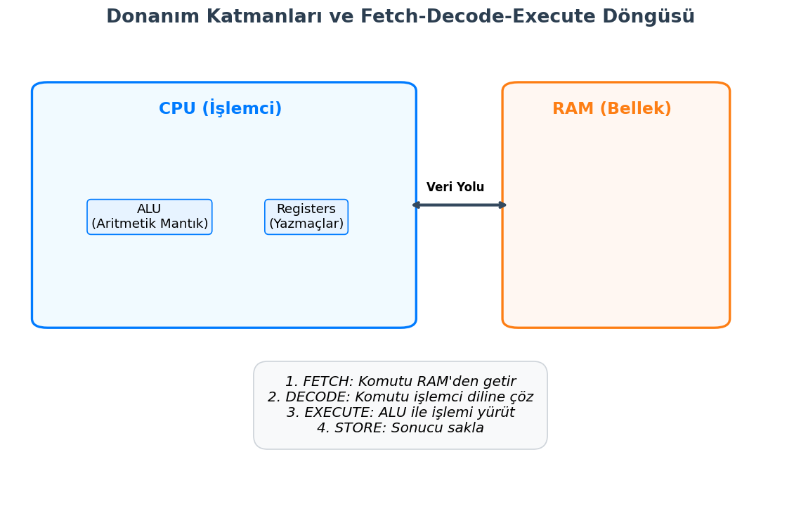
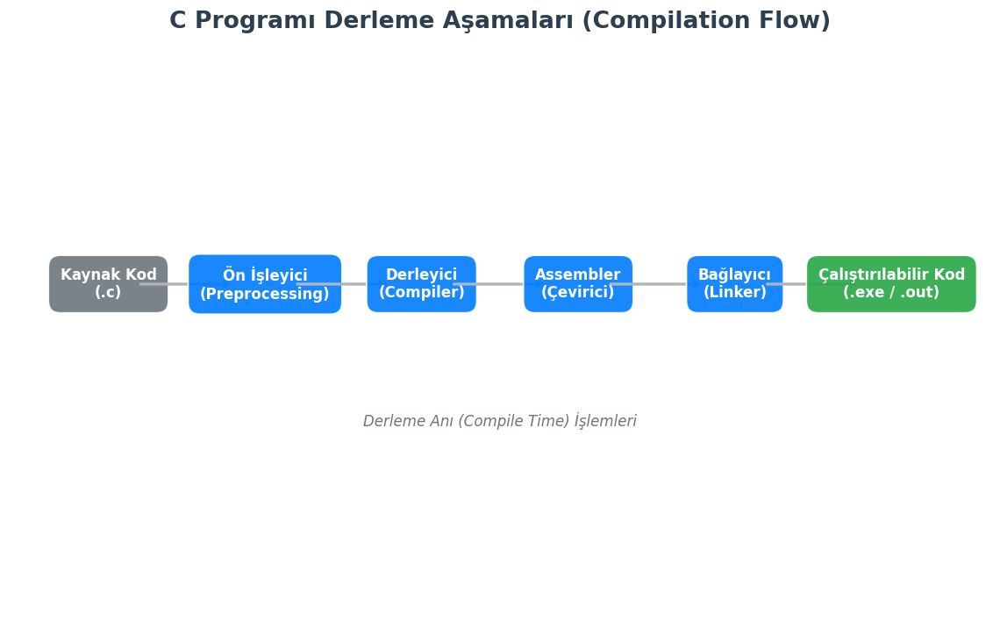
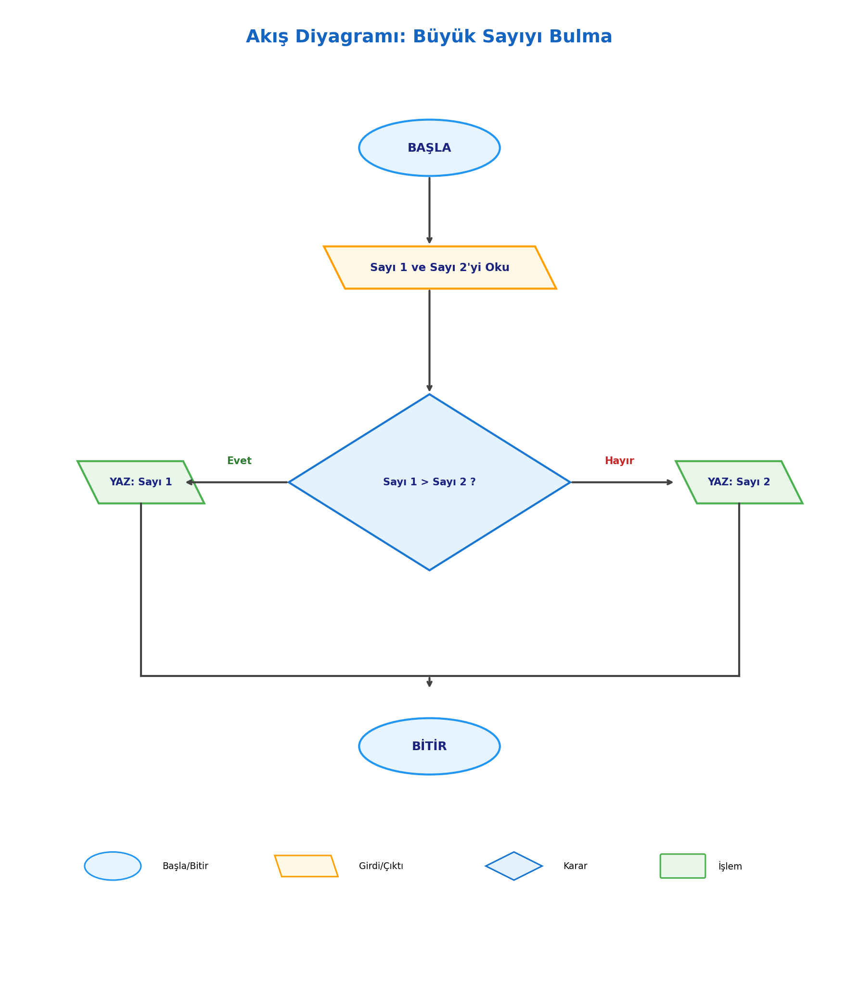
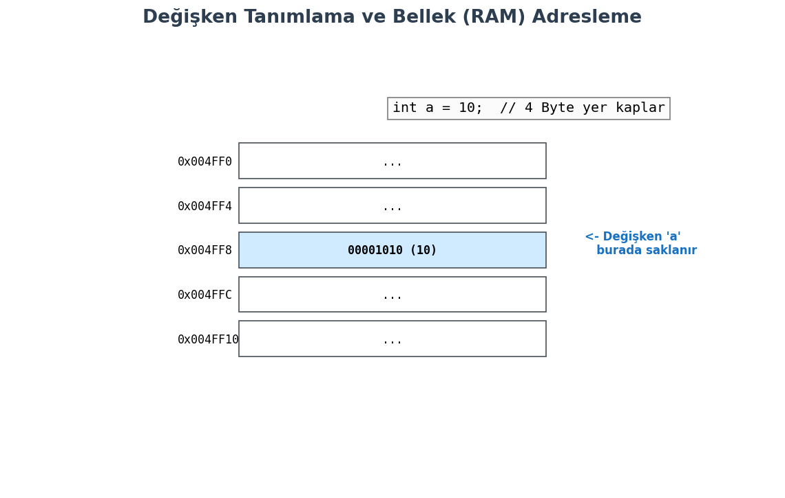

# Bilgisayar Mimarisi ve Programlamanın Mantığı

*Bir kodun donanım katmanında (CPU, RAM) nasıl işlendiğini, kaynak kodun derlenme (compilation) sürecini, algoritmik düşünme yapısını ve C programlama dilinin bellek odaklı temel veri yapılarını kapsamlı bir şekilde ele almaktadır. Amaç, sadece kod yazmak değil, kodun arka planda nasıl çalıştığını mühendislik perspektifiyle anlamaktır.*

## 1.1. Donanım Katmanları: CPU, RAM ve ALU İlişkisi

Programlama, en temelinde donanıma emir verme sanatıdır. Yazdığımız yüksek seviyeli kodlar, işlemci tarafından anlaşılabilmesi için elektriksel sinyallere dönüşür. Bu sürecin ana aktörleri şunlardır:

* **CPU (Central Processing Unit - Merkezi İşlem Birimi):** Bilgisayarın beynidir. Komutları yorumlar ve yürütür.
* **ALU (Arithmetic Logic Unit - Aritmetik Mantık Birimi):** CPU'nun içinde bulunan, matematiksel (toplama, çıkarma) ve mantıksal (VE, VEYA, DEĞİL) işlemleri yapan birimdir.
* **RAM (Random Access Memory - Rastgele Erişimli Bellek):** Çalışan programların verilerinin ve kodlarının geçici olarak tutulduğu hızlı erişim belleğidir.
* **Register (Yazmaçlar):** CPU içinde bulunan, RAM'den çok daha hızlı ancak çok küçük kapasiteli geçici depolama alanlarıdır.

**Komut İşleme Döngüsü (Instruction Cycle):**
Bir program çalışırken CPU şu döngüyü sürekli tekrar eder (Von Neumann Mimarisi):

1.  **Fetch (Getir):** Komut RAM'den alınır.
2.  **Decode (Çöz):** Komutun ne olduğu anlaşılır (Örn: Toplama mı yapılacak?).
3.  **Execute (Yürüt):** İşlem ALU veya diğer birimlerce gerçekleştirilir.
4.  **Store (Sakla):** Sonuç tekrar belleğe veya register'a yazılır.

## 1.2. Derleyici (Compiler) Mantığı: Kaynak Koddan Makine Koduna

Bilgisayarlar C dilini (kaynak kod) doğrudan anlayamazlar; sadece 0 ve 1'lerden oluşan makine dilini (binary) anlarlar. Bu dönüşümü **Derleyici (Compiler)** yapar.

**Bir C Programının Derlenme Aşamaları (GCC Örneği):**

1.  **Ön İşleme (Preprocessing):** `#include` ve `#define` gibi komutlar işlenir. Yorum satırları silinir. (Dosya uzantısı: `.i`)
2.  **Derleme (Compilation):** Temizlenmiş kod, Assembly diline çevrilir. (Dosya uzantısı: `.s`)
3.  **Çevirme (Assembler):** Assembly kodu, makine koduna (Object code) dönüştürülür. (Dosya uzantısı: `.o` veya `.obj`)
4.  **Bağlama (Linking):** Yazılan kod, standart kütüphanelerle (örn: `printf` fonksiyonunun kodu) birleştirilerek çalıştırılabilir dosya oluşturulur. (Dosya uzantısı: `.exe` veya `.out`)

# 2. Algoritmik Problem Çözme Kavramları

Kodlamaya başlamadan önce çözüm yolunun tasarlanması gerekir. Bu süreç **Algoritma** geliştirmedir. Algoritma, bir problemin çözümü için takip edilen sonlu adımlar dizisidir.

## 2.1. Sözde Kod (Pseudo-code) ve Akış Diyagramları (Flowcharts)

Algoritmaları ifade etmenin iki temel yolu vardır:

* **Sözde Kod (Pseudo-code):** Herhangi bir programlama diline bağlı kalmadan, konuşma diline yakın bir yapıda mantığın yazılmasıdır.
    * *Örn:* `BAŞLA -> Sayi1 Oku -> Sayi2 Oku -> Toplam = Sayi1 + Sayi2 -> YAZ Toplam -> BİTİR`
* **Akış Diyagramları (Flowcharts):** Algoritmanın geometrik şekillerle görselleştirilmesidir.
    * **Elips:** Başla/Bitir
    * **Paralelkenar:** Veri Girişi/Çıkışı
    * **Dikdörtgen:** İşlem/Atama
    * **Eşkenar Dörtgen:** Karar/Koşul (If)

## 2.2. Programlama Paradigmalara Giriş: Neden C?

C dili, **Prosedürel (Yapısal) Programlama** paradigmasını benimser. Program, fonksiyonlar ve prosedürler halinde alt parçalara bölünür.

**Neden C Öğreniyoruz?**
* **Donanım Kontrolü:** Bellek adreslerine (pointer) doğrudan erişim sağlar.
* **Taşınabilirlik:** Hemen hemen her işlemci mimarisi için bir C derleyicisi vardır.
* **Temel Oluşturma:** C++, Java, Python gibi modern dillerin sözdizimi ve mantığı C üzerine kuruludur.
* **İşletim Sistemleri:** Windows, Linux ve macOS çekirdeklerinin büyük kısmı C ile yazılmıştır.

# 3. C Dili Yapısı ve İlk Program

Bir C programı belirli bir iskelet yapısına sahiptir.

## 3.1. Standart Kütüphaneler ve main() Fonksiyonu

C dilinin çekirdeği çok küçüktür; ekrana yazı yazmak gibi işlemler için kütüphanelere ihtiyaç duyarız.

**Hello World Analizi:**

    // stdio.h: Standard Input Output (Giriş Çıkış) kütüphanesidir.
    // printf fonksiyonunu kullanabilmek için gereklidir.
    #include <stdio.h> 

    // main: Programın başlangıç noktasıdır (Entry Point).
    // İşletim sistemi programı çalıştırırken bu fonksiyonu çağırır.
    int main() {
        
        // Ekrana metin basar. \n imleci alt satıra indirir.
        printf("Merhaba, Veri Defteri!\n"); 
        
        // return 0: Programın hatasız sonlandığını işletim sistemine bildirir.
        return 0; 
    }

## 3.2. Kod Yazım Standartları (Syntax & Semantics)

Derleyicinin kodu anlayabilmesi için belirli kurallara (Syntax) uymak zorunludur:

* **Noktalı Virgül (;):** Her komut satırının sonuna konulmalıdır. Cümle sonundaki nokta gibidir.
* **Süslü Parantez ({}):** Kod bloklarını (scope) belirtir. `main` fonksiyonunun nerede başlayıp nerede bittiğini gösterir.
* **Büyük/Küçük Harf Duyarlılığı (Case Sensitivity):** `Main`, `MAIN` ve `main` C dili için farklı kelimelerdir. Doğrusu `main`dir.
* **Yorum Satırları:** Derleyici tarafından görmezden gelinir.
    * Tek satır için: `// Yorum`
    * Çok satır için: `/* Yorum Bloğu */`

# 4. Veri Türleri ve Bellek Yönetimi (Memory Perspective)

C dilinde her değişken, bellekte (RAM) belirli bir yer kaplar ve bir türe sahip olmak zorundadır (Statik Tipli Dil).

## 4.1. Temel Veri Tipleri (int, float, char, double)

Veri tipleri, değişkenin saklayacağı değerin türünü ve bellekte kaplayacağı boyutu belirler.

* **char:** Karakter saklar (Örn: 'A'). Bellekte **1 Byte** yer kaplar.
* **int:** Tam sayı saklar (Örn: 2024). Genellikle **4 Byte** (32-bit sistemlerde).
* **float:** Ondalıklı sayı saklar (Örn: 3.14). Genellikle **4 Byte**. Hassasiyeti düşüktür (6-7 basamak).
* **double:** Çift duyarlıklı ondalıklı sayı. Genellikle **8 Byte**. Hassasiyeti yüksektir (15 basamak).

**sizeof() Operatörü:**
Veri tiplerinin o anki sistemde kaç byte yer kapladığını verir.

    #include <stdio.h>

    int main() {
        printf("int boyutu: %lu byte\n", sizeof(int));
        printf("float boyutu: %lu byte\n", sizeof(float));
        printf("char boyutu: %lu byte\n", sizeof(char));
        printf("double boyutu: %lu byte\n", sizeof(double));
        return 0;
    }

## 4.2. Değişken Tanımlama ve Bellekte Adresleme

`int a = 10;` komutu çalıştığında arka planda şunlar olur:
1.  **Yer Ayırma (Allocation):** RAM'de `int` boyutu kadar (4 byte) boş bir alan bulunur.
2.  **İsimlendirme:** Bu alana yazılımsal olarak `a` ismi verilir.
3.  **Atama (Assignment):** Bu alanın içine ikili tabanda (binary) 10 değeri yazılır.
4.  **Adresleme:** Bu alanın benzersiz bir bellek adresi (Örn: `0x7ffee4`) vardır.

## 4.3. Sabitler (Constants) ve volatile Kavramı

Değeri program boyunca değişmeyecek veriler için sabitler kullanılır.

1.  **#define (Makro):** Ön işlemci (Preprocessor) tarafından işlenir. Bellekte yer kaplamaz, derleme anında kodun içine "yapıştırılır".
    * `#define PI 3.14`
2.  **const Anahtar Kelimesi:** Derleyici seviyesindedir. Bellekte yer kaplar, veri tipi vardır ancak değeri salt okunurdur.
    * `const int MAX_HIZ = 120;`

**volatile Kavramı:**
Gömülü sistemlerde çok önemlidir. Derleyiciye "Bu değişkenin değeri benim kontrolüm dışında (donanım veya başka bir thread tarafından) değişebilir, bu yüzden optimizasyon yapma, her seferinde RAM'den oku" talimatı verir.

    #include <stdio.h>
    #define PI 3.14159 // Makro sabiti

    int main() {
        const int YARICAP = 5; // Değiştirilemez değişken
        
        // YARICAP = 10; // HATA! const değeri değiştirilemez.
        
        double alan = PI * YARICAP * YARICAP;
        printf("Dairenin Alani: %f\n", alan);
        
        return 0;
    }
