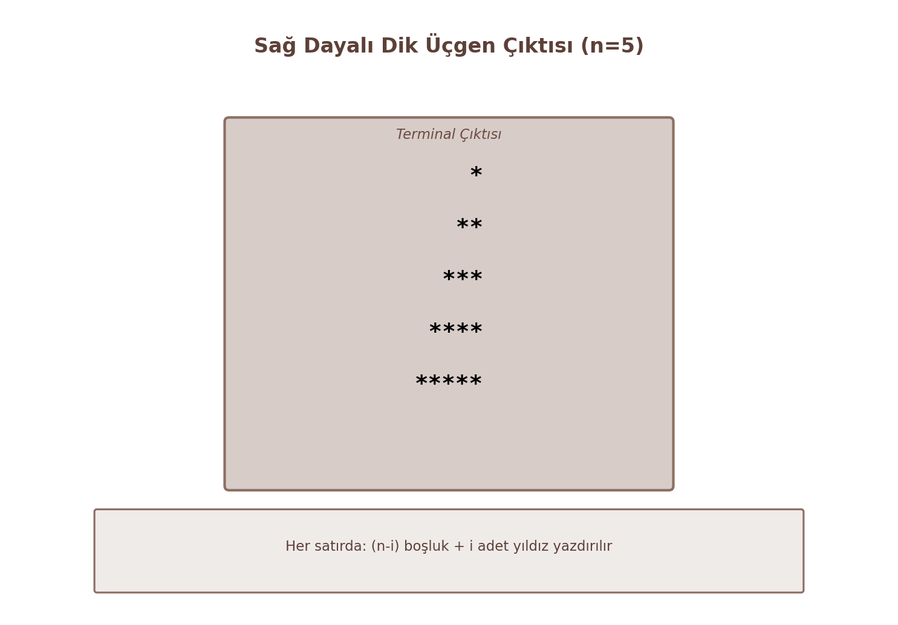

# Karar Yapıları (Decision Structures)

*Bu bölümde, programların doğrusal akışını değiştirerek belirli koşullara göre farklı kod bloklarının nasıl çalıştırılacağı incelenmektedir. Mantıksal operatörler yardımıyla kurulan karar mekanizmaları (if-else, switch-case) ve kısa yol ifadeleri (ternary) akademik bir perspektifle ele alınmıştır.*

## 1.1. Koşullu İfadeler: if, else if ve else
Programlama dillerinde kontrol akışının en temel yapı taşı `if` bloklarıdır. Bir koşulun doğru (`true` / sıfırdan farklı) veya yanlış (`false` / sıfır) olması durumuna göre programın dallanmasını sağlar.

**Örnek: Çoklu Koşul ile Harf Notu Hesaplama**

    #include <stdio.h>

    int main() {
        int not;
        printf("Notunuzu giriniz (0-100): ");
        scanf("%d", &not);

        if (not >= 90) {
            printf("Harf Notu: AA\n");
        } else if (not >= 80) {
            printf("Harf Notu: BA\n");
        } else if (not >= 70) {
            printf("Harf Notu: BB\n");
        } else if (not >= 60) {
            printf("Harf Notu: CB\n");
        } else {
            printf("Harf Notu: FF (Basarisiz)\n");
        }
        return 0;
    }

## 1.2. Mantıksal Operatörler ve İlişkisel İfadeler
Karmaşık kararlar verilirken birden fazla koşulun birleştirilmesi gerekir.

* **&& (VE - AND):** Her iki koşul da doğruysa sonuç doğrudur.
* **|| (VEYA - OR):** Koşullardan en az biri doğruysa sonuç doğrudur.
* **! (DEĞİL - NOT):** Mevcut mantıksal değerin tersini alır.

**Kısa Devre (Short-Circuit) Mantığı:** `&&` operatöründe ilk ifade yanlışsa, ikinciye bakılmaz. `||` operatöründe ise ilk ifade doğruysa, ikinci ifade değerlendirilmez. Bu, performans ve hata önleme (örneğin sıfıra bölme kontrolü) açısından kritiktir.

**Örnek: Artık Yıl Kontrolü**

    int yil;
    printf("Yil giriniz: ");
    scanf("%d", &yil);

    if ((yil % 4 == 0 && yil % 100 != 0) || (yil % 400 == 0)) {
        printf("%d bir artik yildir.\n", yil);
    } else {
        printf("%d artik yil degildir.\n", yil);
    }

## 1.3. Çok Yönlü Karar Yapısı: switch-case
Sadece sabit değerlerin (tam sayı veya karakter) eşitlik kontrolü yapıldığı durumlarda `if-else` hiyerarşisi yerine `switch-case` kullanımı kodun okunabilirliğini artırır. `break` anahtar kelimesi, eşleşen durumdan sonra akışın diğer `case` bloklarına sızmasını engeller.

**Örnek: Basit Hesap Makinesi**

    char islem;
    double s1, s2;
    printf("Islem secin (+, -, *, /): ");
    scanf(" %c", &islem);
    printf("Iki sayi girin: ");
    scanf("%lf %lf", &s1, &s2);

    switch (islem) {
        case '+':
            printf("%.2f + %.2f = %.2f\n", s1, s2, s1 + s2);
            break;
        case '-':
            printf("%.2f - %.2f = %.2f\n", s1, s2, s1 - s2);
            break;
        case '*':
            printf("%.2f * %.2f = %.2f\n", s1, s2, s1 * s2);
            break;
        case '/':
            if (s2 != 0) printf("%.2f / %.2f = %.2f\n", s1, s2, s1 / s2);
            else printf("Hata: Sifira bolme!\n");
            break;
        default:
            printf("Gecersiz islem!\n");
    }

## 1.4. Ternary (Üçlü) Operatör: ? :
Kısa koşullu atamalar için kullanılan bir sözdizimidir. Formül: `koşul ? doğruysa_değer : yanlışsa_değer;`

    int sayi = 10;
    char *sonuc = (sayi % 2 == 0) ? "Cift" : "Tek";

---

# 2. Döngü Yapıları (Loops)

Döngüler, belirli bir kod bloğunun belirli bir koşul altında tekrar tekrar çalıştırılmasını sağlar.

## 2.1. Koşul Kontrollü Döngü: while
Döngüye girmeden önce koşul kontrol edilir. Eğer koşul en başta yanlışsa döngü hiç çalışmaz. Belirsiz sayıda iterasyonun olduğu durumlar için idealdir.

**Örnek: Negatif Sayı Girene Kadar Toplama**

    int sayi, toplam = 0;
    printf("Sayi girin (cikmak icin negatif): ");
    scanf("%d", &sayi);
    while (sayi >= 0) {
        toplam += sayi;
        printf("Sayi girin: ");
        scanf("%d", &sayi);
    }
    printf("Toplam: %d\n", toplam);

## 2.2. En Az Bir Kez Çalışan Döngü: do-while
Koşul döngü bloğunun sonunda kontrol edilir. Bu, kodun **en az bir kez** çalışmasını garanti eder. Genellikle kullanıcı menüleri ve girdi doğrulama için kullanılır.

**Örnek: Menü Tasarımı**

    int secim;
    do {
        printf("\n1. Baslat\n2. Ayarlar\n0. Cikis\nSecim: ");
        scanf("%d", &secim);
    } while (secim != 0);

## 2.3. Sayıcı Kontrollü Döngü: for
İterasyon sayısının önceden bilindiği durumlarda kullanılır. Başlangıç değeri, koşul ve artış miktarı tek satırda tanımlanır.

**Örnek: Belirli Aralıktaki Asal Sayıları Bulma**

    int i, j, asal;
    for (i = 2; i <= 50; i++) {
        asal = 1;
        for (j = 2; j <= i / 2; j++) {
            if (i % j == 0) {
                asal = 0;
                break;
            }
        }
        if (asal) printf("%d ", i);
    }

---

# 3. İleri Seviye Döngü Kontrolü ve Optimizasyon

## 3.1. Döngü Kontrol Anahtarları: break ve continue
* **break:** İçinde bulunduğu döngüyü anında sonlandırır ve döngüden sonraki satıra geçer.
* **continue:** Döngünün mevcut iterasyonunu o noktada keser ve bir sonraki iterasyona (koşul kontrolüne/artışa) geçer.

**Örnek: Sadece Çift Sayıları Basan Yapı**

    for (int i = 1; i <= 100; i++) {
        if (i % 2 != 0) continue; // Tek sayıysa alt satıra geçme, döngü başına dön
        printf("%d ", i);
    }

## 3.2. Sonsuz Döngüler ve Hatalı Mantık (Infinite Loops)
Döngü koşulunun hiçbir zaman `false` olmadığı durumlarda oluşur. Genellikle artış miktarının unutulması veya yanlış mantıksal operatör kullanımıyla tetiklenir.
`while(1)` veya `for(;;)` bilinçli sonsuz döngü örnekleridir ancak içinde bir `break` mekanizması barındırmalıdır.

---

# 4. İç İçe Döngüler (Nested Loops) ile Problem Çözümü

## 4.1. Matris Mantığı ve Koordinat Sistemi
Bir döngünün gövdesinde başka bir döngünün bulunmasıdır. Dış döngü satırları, iç döngü ise sütunları temsil eder.

**Örnek: Çarpım Tablosu**

    for (int i = 1; i <= 10; i++) {
        for (int j = 1; j <= 10; j++) {
            printf("%d\t", i * j);
        }
        printf("\n");
    }

## 4.2. Geometrik Desenlerin Oluşturulması
Döngü sınırlarının birbirine bağımlı hale getirilmesiyle karmaşık desenler çizilebilir.

**Örnek: Sağ Dayalı Dik Üçgen**

    int n = 5;
    for (int i = 1; i <= n; i++) {
        // Bosluklar icin
        for (int j = 1; j <= n - i; j++) {
            printf(" ");
        }
        // Yildizlar icin
        for (int k = 1; k <= i; k++) {
            printf("*");
        }
        printf("\n");
    }
    

## 4.3. Algoritmik Verimlilik Giriş: Zaman Karmaşıklığı (Big O)
Programın çalışma süresinin veri girişi miktarına göre nasıl değiştiğini ifade eder. 

* Tek bir `for` döngüsü genellikle $O(n)$ (lineer) karmaşıklıktadır.
* İç içe iki döngü ise $O(n^2)$ (quadratik) maliyete yol açar.

**Verimlilik Notu:** Bir dizideki tekrarlayan elemanları bulmak için her elemanı diğer tüm elemanlarla karşılaştıran iç içe döngü yapısı, veri seti büyüdükçe (örneğin $n=100.000$ olduğunda) performansı ciddi şekilde düşürür. Bu yüzden döngüleri optimize etmek ve gereksiz iterasyonlardan kaçınmak profesyonel yazılım geliştirmenin temelidir.