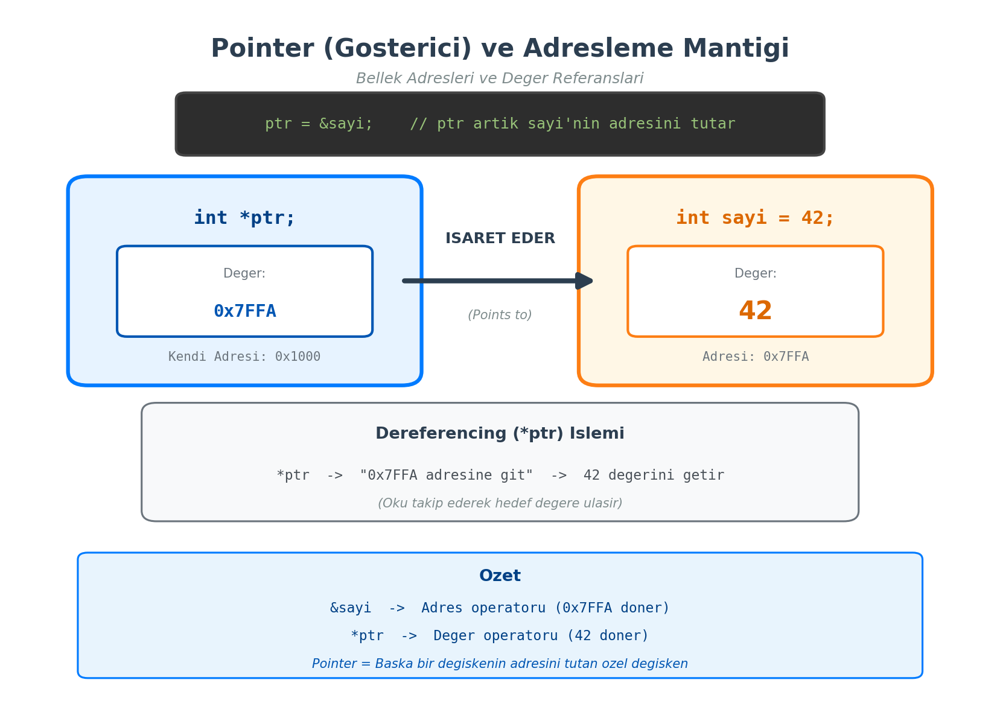
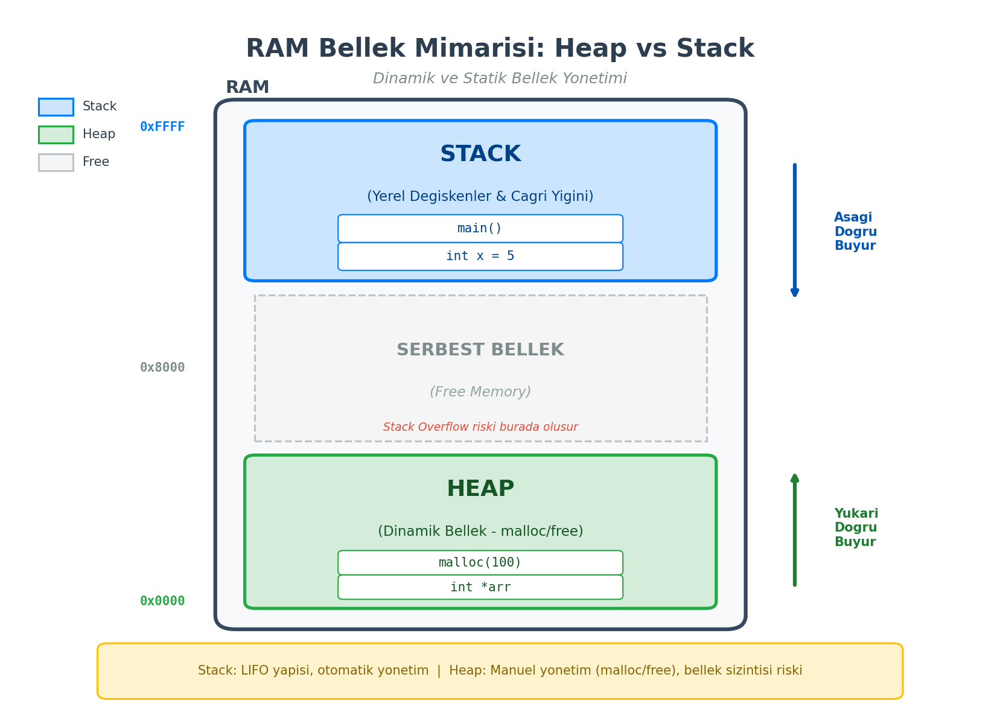

# Programlamada İleri Seviye Bellek ve Veri Yönetimi

*Bu ders notu, C programlama dilinin temelini oluşturan göstericiler (pointers), programların çalışma esnasında (runtime) esnek bellek kullanımı sağlayan dinamik hafıza yönetimi ve verilerin disk üzerinde kalıcı olarak saklanmasını sağlayan dosya işleme tekniklerini kapsamaktadır. Bu konular, mühendislik düzeyinde yazılım geliştirme ve sistem kaynaklarının optimize edilmesi açısından kritik öneme sahiptir.*

## Göstericiler (Pointers)

Göstericiler, C dilini diğer yüksek seviyeli dillerden ayıran en güçlü araçlardan biridir. Bir gösterici, doğrudan bir veri değerini değil, o verinin bellekte saklandığı **adresi** tutan bir değişkendir.

### Gösterici Mantığı ve Bellek Adresleme ($*$, $\&$ Operatörleri)

Bilgisayar belleği (RAM), her biri benzersiz bir adrese sahip olan hücrelerden oluşur. Programımızda bir değişken tanımladığımızda, işletim sistemi bu değişkene bellekte bir yer ayırır.

* **$\&$ (Adres Operatörü):** Bir değişkenin bellekteki başlangıç adresini döndürür.
* **$*$ (Gösterici Deklarasyonu ve Değer Operatörü):** Bir gösterici tanımlamak için kullanılır veya bir adresteki değere erişmek (dereferencing) için tercih edilir.

**Örnek: Adres Erişimi ve Değer Değiştirme**

    int sayi = 42;          // Normal değişken
    int *ptr;               // Gösterici tanımlama
    ptr = &sayi;            // sayi değişkeninin adresini ptr'ye ata

    printf("Sayinin degeri: %d\n", sayi);
    printf("Sayinin adresi: %p\n", (void*)&sayi);
    printf("Pointer'in tuttugu adres: %p\n", (void*)ptr);

    *ptr = 100;             // ptr üzerinden sayi'nin degerini degistir
    printf("Sayinin yeni degeri: %d\n", sayi);

**Önemli Not:** Göstericilerin bellekte kapladığı boyut, sakladıkları veri tipine (int, char, float) bağlı değildir; kullanılan işlemci mimarisine bağlıdır (Örneğin, 64-bit bir sistemde genellikle 8 byte yer kaplarlar).

### Göstericiler ile Parametre Aktarımı (Call by Reference)

Fonksiyonlara parametre gönderirken varsayılan yöntem "Değer ile Çağırma"dır (Call by Value). Bu yöntemde fonksiyon orijinal verinin bir kopyasıyla çalışır. Ancak göstericiler kullanılarak adres gönderildiğinde (Call by Reference), fonksiyon orijinal veri üzerinde doğrudan değişiklik yapabilir.

**Örnek: Başarılı Swap (Yer Değiştirme) Fonksiyonu**

    void swap(int *x, int *y) {
        int temp = *x;
        *x = *y;
        *y = temp;
    }

    int main() {
        int a = 10, b = 20;
        swap(&a, &b); // Adresleri gönderiyoruz
        printf("a: %d, b: %d\n", a, b); // a: 20, b: 10 olur
        return 0;
    }

## Hafızadan Dinamik Yer Ayrımı (Dynamic Memory Allocation)

Standart dizilerde boyut derleme zamanında (compile-time) belirlenmelidir. Dinamik bellek yönetimi ise program çalışırken ihtiyaç duyulan miktar kadar yer ayrılmasını sağlar. Bu veriler belleğin **Heap** bölgesinde tutulur.

### malloc, calloc, realloc ve free Fonksiyonları

Dinamik bellek yönetimi için `<stdlib.h>` kütüphanesi kullanılır:

1.  `malloc(size)`: Belirtilen boyutta bellek ayırır, içeriği temizlemez (çöp değerler kalabilir).
2.  `calloc(n, size)`: `n` adet eleman için yer ayırır ve tüm bitleri sıfıra set eder.
3.  `realloc(ptr, new_size)`: Daha önce ayrılmış bir bellek bloğunun boyutunu günceller.
4.  `free(ptr)`: Ayrılan belleği sisteme geri iade eder.

**Örnek: Dinamik Dizi Oluşturma**

    int n, *dizi;
    printf("Dizi boyutu girin: ");
    scanf("%d", &n);

    // Hafizadan n tane int boyutu kadar yer ayir
    dizi = (int*) malloc(n * sizeof(int));

    if (dizi == NULL) {
        printf("Bellek ayrilamadi!\n");
        return 1;
    }

    // Islemler bittikten sonra bellek iade edilmelidir
    free(dizi);

### Bellek Sızıntıları (Memory Leaks) ve Yönetimi

Ayrılan bir bellek bloğu `free()` fonksiyonu ile iade edilmezse, o bellek program kapansa dahi "kullanımda" görünmeye devam edebilir. Uzun süre çalışan programlarda bu durum sistem kaynaklarının tükenmesine (Memory Leak) yol açar. Profesyonel yazılım geliştirme sürecinde, her `malloc` işleminin mutlaka bir `free` karşılığı olmalıdır.

## Dosya Yapıları ve Uygulamaları (File I/O)

Programdaki verilerin, program sonlandığında kaybolmaması için sabit disk üzerinde dosyalara kaydedilmesi gerekir. C dilinde dosya işlemleri `FILE` göstericisi üzerinden yürütülür.

### Dosya Açma, Okuma ve Yazma İşlemleri (fopen, fprintf, fscanf)

Temel dosya işlemleri şunlardır:

* `fopen(dosya_adi, mod)`: Dosyayı açar (modlar: "r" okuma, "w" yazma, "a" ekleme).
* `fclose(fp)`: Dosyayı kapatır.
* `fprintf` / `fscanf`: Dosyaya formatlı veri yazar veya dosyadan okur.

**Örnek: Öğrenci Bilgilerini Kaydetme**

    FILE *dosya;
    dosya = fopen("ogrenciler.txt", "w");

    if (dosya == NULL) {
        printf("Dosya acilamadi!\n");
        return 1;
    }

    char ad[30] = "Ali Can";
    int numara = 12345;

    fprintf(dosya, "Numara: %d, Ad: %s\n", numara, ad);
    printf("Veri basariyla kaydedildi.\n");

    fclose(dosya);

Dosya işlemleri bittikten sonra `fclose()` komutunun çağrılması, tampon bellekten (buffer) diske verilerin tam yazılmasını ve dosya kilitlerinin kaldırılmasını sağlar.