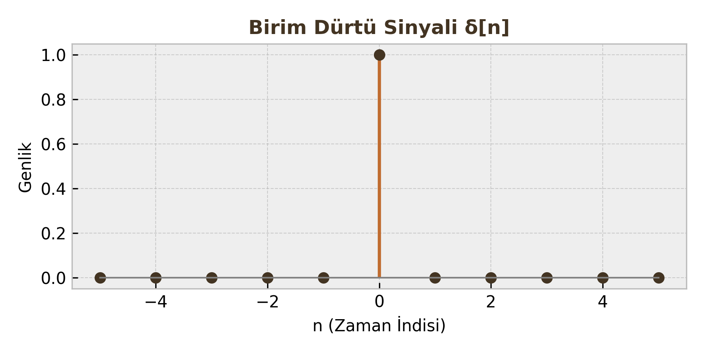

# Sayısal İşaret İşleme: Ayrık Zamanlı İşaretler ve Temel Özellikler

Bu ders notu, Sayısal İşaret İşleme (DSP) dersinin giriş konusu olan **Ayrık Zamanlı İşaretler (Discrete-Time Signals)** kavramını, matematiksel modellerini, sınıflandırmasını ve temel işlemlerini kapsamaktadır.

---

## 1. Ayrık Zamanlı İşaretler Nedir?

Ayrık zamanlı bir işaret, bağımsız değişkenin (genellikle zaman) sadece tam sayı değerleri aldığı bir fonksiyondur. Sürekli zamanlı (analog) bir sinyalin, belirli aralıklarla örneklenmesiyle elde edilir.

**Matematiksel Gösterim:**

$$x(n) = \{..., x(-1), x(0), x(1), ...\}$$

Burada $n$ bir tam sayıdır ($n \in \mathbb{Z}$) ve "örnek indisi" olarak adlandırılır. $x(n)$ ise o andaki genlik değeridir.

!!! note "Öğrenci Notu"
    $x(n)$ gösterimindeki parantez bazen $x[n]$ olarak da kullanılır. İkisi de aynı anlama gelir; ancak sürekli zamandaki $x(t)$'den ayırt etmek için köşeli parantez literatürde daha yaygındır.

---

## 2. Temel Sinyaller (Elementary Signals)

DSP analizinde sistemleri test etmek ve karmaşık sinyalleri modellemek için kullanılan yapı taşlarıdır.

### A. Birim Dürtü (Unit Impulse - δ[n])

Sadece $n=0$ anında 1 değerini alan işaretin tanımı:

$$
\delta[n] =
\begin{cases}
1, & n = 0 \\\\
0, & n \neq 0
\end{cases}
$$

**Önemli Özellikler:**

1.  **Örnekleme Özelliği (Sampling Property):** Bir sinyali dürtü ile çarparsanız, sadece dürtünün olduğu yerdeki değeri alırsınız.

    $$
    x(n)\delta(n-k) = x(k)\delta(n-k)
    $$

2.  **Eleme Özelliği (Sifting Property):** Aşağıdaki eşitlik her zaman sağlanır:

    $$
    \sum_{n=-\infty}^{\infty} x(n)\delta(n-k) = x(k)
    $$

### B. Birim Basamak (Unit Step - u[n])

Birim basamak işareti şu şekilde tanımlanır:

$$
u[n] =
\begin{cases}
1, & n \ge 0 \\\\
0, & n < 0
\end{cases}
$$

**Dürtü ve Basamak İlişkisi:**

* **Dürtüden Basamağa:** Basamak fonksiyonu, dürtülerin toplamıdır.

    $$
    u[n] = \sum_{k=-\infty}^{n} \delta(k)
    $$

* **Basamaktan Dürtüye:** Dürtü, basamağın fark (difference) işlemidir.

    $$
    \delta[n] = u[n] - u[n-1]
    $$

### C. Üstel Sinyaller (Exponential Signals)

#### 1. Reel Üstel İşaretler

Genel form: $x(n) = C \alpha^n$ (Burada $C$ ve $\alpha$ reel sayılardır).

* $|\alpha| > 1$ ise sinyal **üstel olarak büyür**.
* $|\alpha| < 1$ ise sinyal **üstel olarak sönümlenir**.
* $\alpha < 0$ ise sinyal **işaret değiştirerek (alternating)** ilerler.

#### 2. Karmaşık Üstel İşaretler

Genel form:

$$
x(n) = e^{j\omega_0 n}
$$

Euler formülü sayesinde bu işaret sinüzoidal bileşenlere ayrılabilir:

$$
e^{j\omega_0 n} = \cos(\omega_0 n) + j\sin(\omega_0 n)
$$

Burada $\omega_0$, radyan/örnek cinsinden **açısal frekanstır**.

---

## 3. Sinyal Özellikleri

Sinyalleri analiz edebilmek için onları belirli özelliklerine göre sınıflandırmamız gerekir.

### A. Periyodiklik (Periodicity)

Sürekli zamanın aksine, ayrık zamanda her $\sin(\omega_0 n)$ veya $e^{j\omega_0 n}$ periyodik **değildir**.

Bir $x(n)$ işaretinin periyodik olması için şu şart sağlanmalıdır:

$$
x(n) = x(n+N)
$$

Burada $N$, periyodu gösteren pozitif bir **tam sayı** olmalıdır.

**Periyodiklik Şartı:**

Açısal frekans $\omega_0$ şu şartı sağlamalıdır:

$$
\frac{\omega_0}{2\pi} = \frac{m}{N} \quad (\text{Rasyonel Bir Sayı})
$$

* Eğer $\frac{\omega_0}{2\pi}$ rasyonel değilse, sinyal periyodik değildir.
* **Temel Periyot ($N$):** Bu oranı sağlayan en küçük $N$ tam sayısıdır.

!!! warning "Kritik Sınav Bilgisi"
    $\cos(3n)$ periyodik değildir çünkü $3/2\pi$ rasyonel değildir ($\pi$ irrasyoneldir). Ancak $\cos(0.2\pi n)$ periyodiktir.

### B. Simetri: Çift ve Tek İşaretler

Herhangi bir sinyal, çift (even) ve tek (odd) bileşenlerin toplamı olarak ifade edilebilir.

* **Çift Sinyal (Even):** Y eksenine göre simetriktir.

    $$
    x(-n) = x(n)
    $$

* **Tek Sinyal (Odd):** Orijine göre simetriktir.

    $$
    x(-n) = -x(n)
    $$

**Bileşenlerine Ayırma Formülleri:**

| Bileşen | Formül |
| :--- | :--- |
| **Çift Kısım ($x_e[n]$)** | $\frac{1}{2} [x(n) + x(-n)]$ |
| **Tek Kısım ($x_o[n]$)** | $\frac{1}{2} [x(n) - x(-n)]$ |

### C. Enerji ve Güç Sinyalleri

Sinyallerin "büyüklüğünü" ölçmek için enerji veya güç kavramları kullanılır.

**1. Sinyal Enerjisi ($E$):**

$$
E = \sum_{n=-\infty}^{\infty} |x(n)|^2
$$

**2. Sinyal Gücü ($P$):**

$$
P = \lim_{N \to \infty} \frac{1}{2N+1} \sum_{n=-N}^{N} |x(n)|^2
$$

**Karşılaştırma Tablosu:**

| Özellik | Enerji Sinyali | Güç Sinyali |
| :--- | :--- | :--- |
| **Tanım** | Enerjisi sonlu ($0 < E < \infty$), Gücü sıfır olan sinyaller. | Gücü sonlu ($0 < P < \infty$), Enerjisi sonsuz olan sinyaller. |
| **Örnek** | Sönümlü üstel, sonlu süreli kare dalga. (Genellikle periyodik olmayan, sönen sinyaller) | Sinüs, Kosinüs, Birim Basamak. (Genellikle periyodik ve devamlı sinyaller) |
| **Enerji/Güç Değeri** | $E$: Sabit Sayı, $P$: 0 | $E$: $\infty$, $P$: Sabit Sayı |

---

## 4. İşaret Dönüşümleri (Transformations)

Bağımsız değişken $n$ üzerinde yapılan işlemlerdir.

### A. Öteleme (Shifting)

Sinyalin zaman ekseninde kaydırılmasıdır.

* **Gecikme (Delay):** $x(n-k)$ $\rightarrow$ Sinyal sağa kayar ($k>0$).
* **İlerleme (Advance):** $x(n+k)$ $\rightarrow$ Sinyal sola kayar ($k>0$).

### B. Ters Çevirme (Reflection / Folding)

Sinyalin $n=0$ eksenine göre aynalanmasıdır.

$$
y(n) = x(-n)
$$

Geçmiş değerler geleceğe, gelecek değerler geçmişe döner.

### C. Zaman Ölçekleme (Time Scaling)

Ayrık zamanda ölçekleme ($x(an)$), sürekli zamandaki gibi basit değildir.

* **Örnekleme Azaltma (Decimation):** $y(n) = x(2n)$ (Örneğin 2 kat hızlandırma). Ara değerler (örneğin $x(1), x(3)$) kaybolur. Veri kaybı riski vardır.
* **Örnekleme Artırma (Interpolation):** $y(n) = x(n/L)$. Genellikle iki örnek arasına sıfır eklenerek (zero-padding) yapılır, ardından filtreleme gerekir.

---

### Hızlı Bir Alıştırma (Vize Sorusu Tipi)

**Soru:** $x(n) = \cos(\frac{\pi}{4}n)$ işaretinin periyodunu bulunuz.

**Çözüm:**

1.  $\omega_0 = \frac{\pi}{4}$
2.  Şart: $\frac{\omega_0}{2\pi} = \frac{m}{N}$
3.  $\frac{\pi/4}{2\pi} = \frac{1}{8}$
4.  Bu oran rasyoneldir ($1/8$). En küçük tam sayı $N=8$'dir.
5.  **Sonuç:** Sinyal periyodiktir ve periyodu $N=8$ örnektir.