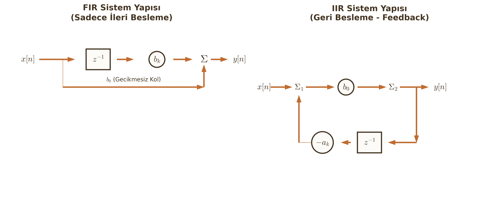

# Fark Denklemleri (Difference Equations)

Sürekli zamanlı sistemleri diferansiyel denklemlerle modellediğimiz gibi, ayrık zamanlı sistemleri de **Fark Denklemleri** ile modelleriz. Bu konu, DSP'nin en "matematiksel" kısmıdır ve filtre tasarımının (IIR/FIR) temelini oluşturur.

---

## Tanım ve LCCDE Yapısı

Bir sistemin çıkışı ($y[n]$); geçmiş çıkış değerlerine ve o anki/geçmiş giriş değerlerine bağlıysa, bu ilişki bir fark denklemi ile gösterilir.

**Doğrusal Sabit Katsayılı Fark Denklemi (LCCDE):**
En genel form şöyledir:

$$
\sum_{k=0}^{N} a_k y[n-k] = \sum_{k=0}^{M} b_k x[n-k]
$$

Burada:

* $y[n-k]$ terimleri **Geri Beslemeyi (Feedback)** temsil eder.
* $a_k$ ve $b_k$ sistemin sabit katsayılarıdır.
* Genellikle $a_0 = 1$ kabul edilir (veya denklemin tamamı $a_0$'a bölünür).

---

## Çözüm Yöntemi (Klasik Yöntem)

Diferansiyel denklemlerle neredeyse aynı mantıkla, 3 aşamada çözülür:

**Toplam Çözüm = Homojen Çözüm + Özel Çözüm**

$$y[n] = y_h[n] + y_p[n]$$

### Adım 1: Homojen Çözüm ($y_h[n]$)
Sistemin dışarıdan bir giriş olmadığında ($x[n]=0$) kendi doğası gereği nasıl davrandığını (sönümleme vb.) gösterir.

1.  Denklemdeki giriş terimlerini ($x$) sıfıra eşitle.
2.  $y[n]$ yerine $r^n$ koyarak **Karakteristik Denklemi** oluştur.
3.  Bu polinomun köklerini ($r_1, r_2, \dots$) bul.

**Çözüm Formatı:**

$$y_h[n] = c_1 (r_1)^n + c_2 (r_2)^n + \dots$$

!!! warning "Kritik Sınav Bilgisi"
    Eğer kökler çakışıksa (katlı kök varsa, örn: $r_1=r_2=0.5$), ikinci kökü birbirinden ayırmak için $n$ ile çarparız:
    $$y_h[n] = c_1 (0.5)^n + c_2 \cdot n \cdot (0.5)^n$$

### Adım 2: Özel Çözüm ($y_p[n]$)
Sistemin uygulanan girişe ($x[n]$) uyum sağlamak için ürettiği cevaptır. Giriş sinyalinin formuna "benzeyen" bir çözüm tahmin edilir.

**Giriş Sinyaline Göre Tahmin Tablosu:**

| Giriş Sinyali ($x[n]$) | Tahmin Edilen Özel Çözüm ($y_p[n]$) |
| :--- | :--- |
| **Sabit** ($A$ veya $A u[n]$) | $K$ (Sabit Sayı) |
| **Üstel** ($A \alpha^n$) | $K \alpha^n$ |
| **Sinüzoidal** ($A \cos(\omega_0 n)$) | $K_1 \cos(\omega_0 n) + K_2 \sin(\omega_0 n)$ |
| **Rampa** ($A n$) | $K_1 n + K_0$ |

!!! note "Öğrenci Notu"
    Eğer giriş sinyalinin kökü, homojen çözümün köküyle aynıysa (çakışma varsa), sistem "rezonansa" girer. Bu durumda tablodaki tahmininizi $n$ ile çarpmanız gerekir. (Örn: $K \cdot n \cdot \alpha^n$).

### Adım 3: Toplam Çözüm ve Katsayıların Bulunması

$$y[n] = y_h[n] + y_p[n]$$

Denklemde hala bilinmeyen $c_1, c_2$ gibi katsayılar var. Bunları bulmak için **Başlangıç Koşulları** ($y[-1]$ vb.) kullanılır.

**Dikkat:** Başlangıç koşullarını doğrudan $y_h$ formülüne yazamazsınız! Önce toplam çözüm denkleminde $n=0, n=1$ gibi değerler için sistemin o anki çıkışını yinelemeli olarak hesaplayıp, sonra katsayıları bulmalısınız.

---

## Örnek Soru ve Adım Adım Çözüm

**Soru:**
$y[n] - 0.5y[n-1] = x[n]$ fark denklemi veriliyor.
Giriş $x[n] = u[n]$ (Birim basamak) ve başlangıç koşulu $y[-1] = 0$ ise sistemin cevabını ($n \ge 0$ için) bulunuz.

**Çözüm:**

**1. Homojen Çözüm:**

* Girişi sıfırla: $y[n] - 0.5y[n-1] = 0$
* Karakteristik denklem ($y[n] \to r^n$): $r^n - 0.5r^{n-1} = 0 \implies r - 0.5 = 0$
* Kök: $r = 0.5$
* $$y_h[n] = c \cdot (0.5)^n$$

**2. Özel Çözüm:**

* Giriş $x[n] = u[n]$ (yani $n \ge 0$ için sabit 1).
* Tahmin: $y_p[n] = K$ (Sabit bir sayı).
* Denklemde yerine koy:
    $$K - 0.5K = 1$$
    $$0.5K = 1 \implies K = 2$$
* $$y_p[n] = 2$$

**3. Toplam Çözüm:**

$$y[n] = c \cdot (0.5)^n + 2$$

**4. Katsayıyı ($c$) Bulma:**

Bize $y[-1]=0$ verilmiş ama denklemimiz $n \ge 0$ için kurulu. Önce $n=0$ anındaki gerçek çıkışı ana denklemden manuel bulalım:

* Ana denklem: $y[0] - 0.5y[-1] = x[0]$
* $y[0] - 0.5(0) = 1$ (Çünkü $u[0]=1$)
* Buradan: **$y[0] = 1$** olduğunu bulduk.

Şimdi toplam çözümde $n=0$ yazıp eşitleyelim:
$$y[0] = c \cdot (0.5)^0 + 2 = 1$$
$$c + 2 = 1 \implies c = -1$$

**Sonuç:**
$$y[n] = 2 - (0.5)^n \quad \text{, } n \ge 0$$

---

## Sistem Türleri: FIR ve IIR Karşılaştırması

Fark denklemlerinin yapısına göre filtreler ikiye ayrılır. Bu ayrım vize/finalde sözlü soru olarak gelebilir.

### 1. FIR (Finite Impulse Response - Sonlu Dürtü Cevabı)
Sadece girişlerin ($x[n], x[n-1]$) kullanıldığı sistemlerdir. Geri besleme yoktur.

* **Denklem:** $y[n] = \sum b_k x[n-k]$
* **Özellik:** $y[n-k]$ terimi içermez.
* **Avantaj:** Her zaman kararlıdır (Stability garantidir).

### 2. IIR (Infinite Impulse Response - Sonsuz Dürtü Cevabı)
Çıkışın hesaplanması için geçmiş çıkış değerlerinin ($y[n-1]$) de kullanıldığı sistemlerdir.

* **Denklem:** $y[n] - \sum a_k y[n-k] = \sum b_k x[n-k]$
* **Özellik:** Geri besleme (feedback) vardır. Dürtü cevabı sonsuza kadar gider.
* **Risk:** Kökler birim çemberin dışına çıkarsa sistem kararsızlaşabilir (Patlayabilir).