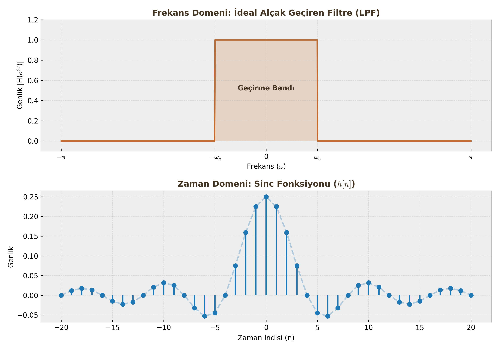

# Fourier Analizi ve Frekans Cevabı

Final sınavlarının kalbi burasıdır. Şimdiye kadar sinyalleri zaman domeninde ($n$) inceledik. Şimdi ise frekans domenine ($\omega$) geçiyoruz. Bu analiz, sinyalin içinde hangi frekansların (bas sesler, tiz sesler) olduğunu ve sistemin bunlara nasıl tepki verdiğini görmemizi sağlar.

---

## 1. Frekans Cevabı (Frequency Response - $H(e^{j\omega})$)

**Tanım:** Kararlı bir LSI sisteme sinüzoidal bir giriş ($e^{j\omega n}$) uygulandığında, çıkış sinyali girişin frekansını değiştirmez, sadece **genliğini** ve **fazını** değiştirir. Sistemim bu değişim karakteristiğine Frekans Cevabı denir.

$$H(e^{j\omega}) = \text{Sistemin Frekans Karakteristiği}$$

### A. Hesaplama Yöntemleri
Sınavda size sistem iki şekilde verilebilir, ikisinden de $H(e^{j\omega})$'yı bulabilmelisiniz:

**1. Dürtü Cevabından ($h[n]$) Geçiş:**
Eğer $h[n]$ verildiyse, DTFT (Ayrık Zamanlı Fourier Dönüşümü) formülü kullanılır:
$$H(e^{j\omega}) = \sum_{n=-\infty}^{\infty} h[n] e^{-j\omega n}$$

**2. Fark Denklemminden (LCCDE) Doğrudan Yazma (Pratik Yol):**
Verilen fark denkleminde $y[n-k]$ yerine $e^{-j\omega k}$ koyarak hızlıca yazabilirsiniz.
Denklem: $\sum a_k y[n-k] = \sum b_k x[n-k]$ ise;

$$H(e^{j\omega}) = \frac{Y(e^{j\omega})}{X(e^{j\omega})} = \frac{\sum b_k e^{-j\omega k}}{\sum a_k e^{-j\omega k}}$$

**Örnek:** $y[n] - 0.5y[n-1] = x[n] + 2x[n-1]$
$$H(e^{j\omega}) = \frac{1 + 2e^{-j\omega}}{1 - 0.5e^{-j\omega}}$$

### B. Genlik ve Faz Tepkisi
Frekans cevabı karmaşık (complex) bir sayıdır. Bunu analiz etmek için iki parçaya ayırırız:

1.  **Genlik Cevabı ($|H(e^{j\omega})|$):** Sistemin hangi frekansları kuvvetlendirip (kazanç), hangilerini zayıflattığını gösterir.
2.  **Faz Cevabı ($\angle H(e^{j\omega})$):** Sistemin sinyali ne kadar geciktirdiğini gösterir.

$$H(e^{j\omega}) = |H(e^{j\omega})| \cdot e^{j\angle H(e^{j\omega})}$$

---

## 2. Ayrık Zamanlı Fourier Dönüşümü (DTFT)

Herhangi bir $x[n]$ sinyalini frekans domenine taşımak için kullanılır.

### Analiz ve Sentez Denklemleri

| İşlem | Formül | Açıklama |
| :--- | :--- | :--- |
| **Analiz (DTFT)** | $X(e^{j\omega}) = \sum_{n=-\infty}^{\infty} x[n]e^{-j\omega n}$ | Zaman $\to$ Frekans |
| **Sentez (Ters DTFT)** | $x[n] = \frac{1}{2\pi} \int_{-\pi}^{\pi} X(e^{j\omega})e^{j\omega n} d\omega$ | Frekans $\to$ Zaman |

!!! warning "Kritik Sınav Bilgisi"
    Ayrık zamanlı sinyallerin spektrumu (DTFT sonucu), **$2\pi$ periyotla** tekrarlanır. Yani $X(e^{j\omega})$ fonksiyonu periyodiktir. Genellikle sadece $-\pi$ ile $\pi$ arasına (Temel Aralık) bakmak yeterlidir.

### Temel Özellikler

Sınav sorularını çözerken uzun uzun integral almak yerine bu özellikleri kullanın:

1.  **Doğrusallık:** $a x_1[n] + b x_2[n] \longleftrightarrow a X_1(e^{j\omega}) + b X_2(e^{j\omega})$
2.  **Zaman Kaydırma (Time Shifting):**
    Sinyali zamanda kaydırmak, frekans spektrumunun **genliğini değiştirmez**, sadece **fazını** değiştirir.
    $$x[n-n_0] \longleftrightarrow e^{-j\omega n_0} X(e^{j\omega})$$
3.  **Konvolüsyon Teoremi (EN ÖNEMLİSİ):**
    Zaman domenindeki o zorlu konvolüsyon işlemi, frekans domeninde basit bir çarpma işlemine dönüşür.
    $$y[n] = x[n] * h[n] \longleftrightarrow Y(e^{j\omega}) = X(e^{j\omega}) \cdot H(e^{j\omega})$$

---

## 3. İdeal Filtreler ve Pratik Analiz

Filtreler, frekans cevabının şekline göre isimlendirilir.

### İdeal Alçak Geçiren Filtre (Low-Pass Filter - LPF)
* **Frekans Domeni:** Belirli bir kesim frekansına ($\omega_c$) kadar genlik 1, sonrasında 0'dır (Dikdörtgen şekli).
* **Zaman Domeni:** Frekanstaki dikdörtgenin ters dönüşümü **Sinc** fonksiyonudur.
    $$h_{LP}[n] = \frac{\sin(\omega_c n)}{\pi n}$$

    

!!! note "Öğrenci Notu"
    İdeal filtreler **nedensel değildir** (sonsuz uzunluktadır ve geleceğe uzanır), bu yüzden fiziksel olarak gerçekleştirilemezler. Pratikte bunlara yaklaşan (IIR/FIR) filtreler tasarlarız.

### Pratik Analiz: "Bu Sistem Hangi Filtredir?"
Sınavda size bir $H(e^{j\omega})$ denklemi verilip "Bu ne tür bir filtredir?" diye sorulursa şu testi uygulayın:

1.  **$\omega = 0$ (DC Bileşen) koy:** Sonuç büyükse (örn: 1), alçak frekansları geçiriyordur.
2.  **$\omega = \pi$ (En Yüksek Frekans) koy:** Sonuç küçükse (örn: 0), yüksek frekansları öldürüyordur.

**Örnek:** $y[n] = \frac{x[n] + x[n-1]}{2}$ (Hareketli Ortalamalar)
* Frekans cevabı: $H(e^{j\omega}) = \frac{1 + e^{-j\omega}}{2}$
* $\omega = 0$ için: $H(e^{j0}) = \frac{1+1}{2} = 1$ (Geçiriyor)
* $\omega = \pi$ için: $H(e^{j\pi}) = \frac{1-1}{2} = 0$ (Yok ediyor)
* **Sonuç:** Alçak Geçiren Filtre (Low-Pass).

---

## 4. Sistem Bağlantıları ve Blok Diyagram Okuma

Karmaşık sistemler genellikle alt sistemlerin birleşimidir. Fourier domeninde analiz yapmak çok kolaydır.

**1. Seri Bağlantı (Cascade):**
İki sistem peş peşe bağlanmıştır.
$$H_{toplam}(e^{j\omega}) = H_1(e^{j\omega}) \cdot H_2(e^{j\omega})$$

**2. Paralel Bağlantı:**
Giriş aynı anda iki sisteme gider, çıkışlar toplanır.
$$H_{toplam}(e^{j\omega}) = H_1(e^{j\omega}) + H_2(e^{j\omega})$$

**3. Geri Beslemeli (Feedback) Bağlantı:**
Sistemin çıkışı bir katsayıyla çarpılıp girişe geri döner.
$$H_{toplam}(e^{j\omega}) = \frac{H_1(e^{j\omega})}{1 \mp H_1(e^{j\omega})H_2(e^{j\omega})}$$
*(Paydadaki işaret: Negatif geri besleme ise $+$, Pozitif ise $-$ olur).*