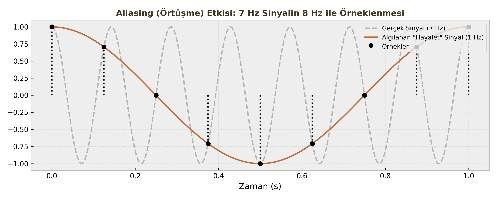

# Örnekleme ve Geri Çatma (Sampling & Reconstruction)

Sayısal İşaret İşleme'nin var olabilmesi için önce gerçek dünyadaki sürekli (analog) sinyallerin bilgisayarın anlayacağı dile (dijital) çevrilmesi gerekir. Bu derste bir sinyalin nasıl dijitalleştirildiğini (A/D) ve işlem bittikten sonra tekrar nasıl analoğa çevrildiğini (D/A) inceleyeceğiz.

---

## 1. Analogdan Dijitale Geçiş (A/D Conversion)

Sürekli zamanlı bir sinyali ($x_a(t)$), bilgisayarda işleyebilmek için belirli zaman aralıklarıyla "fotoğrafını çekmemiz" gerekir. Bu işleme **Örnekleme (Sampling)** denir.

### Temel Tanımlar
* **Örnekleme Periyodu ($T_s$):** İki örnek arasında geçen süre (saniye).
* **Örnekleme Frekansı ($F_s$ veya $\Omega_s$):** Saniyede alınan örnek sayısı (Hz veya rad/sn).
    $$F_s = \frac{1}{T_s} \quad \text{veya} \quad \Omega_s = \frac{2\pi}{T_s}$$

### Matematiksel Model: İmpuls Dizisi
Örnekleme işlemi matematiksel olarak, sürekli sinyalin sonsuz bir **Birim Dürtü Dizisi (Impulse Train)** ile çarpılması olarak modellenir.

$$s(t) = \sum_{n=-\infty}^{\infty} \delta(t - nT_s)$$

Örneklenmiş sinyal ($x_s(t)$):
$$x_s(t) = x_a(t) \cdot s(t) = \sum_{n=-\infty}^{\infty} x_a(nT_s) \cdot \delta(t - nT_s)$$

Buradan ayrık zamanlı diziye ($x[n]$) geçeriz:
$$t \to nT_s \implies x[n] = x_a(nT_s)$$

---

## 2. Nyquist Teoremi (Sampling Theorem)

Bir sinyali örnekledikten sonra, **hiçbir bilgi kaybetmeden** tekrar orijinal haline ($x_a(t)$) döndürebilmemiz mümkün müdür?
Harry Nyquist ve Claude Shannon'a göre cevap: **EVET, ama bir şartla.**

### Teorem Şartı
Eğer analog sinyalin sahip olduğu en yüksek frekans bileşeni $\Omega_{max}$ (Bant genişliği) ise, örnekleme frekansımız $\Omega_s$ şu şartı sağlamalıdır:

$$\Omega_s \ge 2\Omega_{max}$$

Veya Hertz cinsinden: $F_s \ge 2F_{max}$.

### Kritik Tanımlar

| Terim | Tanım |
| :--- | :--- |
| **Nyquist Oranı (Rate)** | Sinyali kurtarmak için gereken **minimum** hız ($2\Omega_{max}$). |
| **Nyquist Frekansı** | Kullandığımız örnekleme frekansının yarısı ($\Omega_s / 2$). Sinyalimizde bu değerden yüksek frekans olmamalıdır. |

!!! warning "Kritik Sınav Bilgisi"
    Sorularda "Nyquist Oranı nedir?" denildiğinde sinyalin frekansının 2 katını ($2F_{max}$), "Nyquist Frekansı nedir?" denildiğinde örnekleme hızının yarısını ($F_s/2$) kastettiklerini unutmayın. Bu ikisi sıkça karıştırılır.

---

## 3. Örtüşme (Aliasing)

Eğer Nyquist kuralına uymazsak, yani **yetersiz örnekleme** yaparsak ($\Omega_s < 2\Omega_{max}$) ne olur?

Cevap: **Aliasing (Örtüşme)** felaketi yaşanır.

### Mekanizma Nasıl İşler?

Frekans domeninde örnekleme işlemi, sinyalin spektrumunun ($X(j\Omega)$) her $\Omega_s$ katında bir **kopyasını oluşturmak** demektir.

* Eğer $\Omega_s$ yeterince büyükse, bu kopyalar birbirinden ayrı durur (Güvenli Bölge).
* Eğer $\Omega_s$ küçükse, kopyalar birbirinin içine girer (Overlap).

### Sonuç: Kimlik Karmaşası
Örtüşme olduğunda, yüksek frekanslı bir sinyal ($\Omega_0$), sanki daha düşük frekanslı başka bir sinyalmiş ($\Omega_0 - \Omega_s$) gibi görünür.

* **Örnek (Wagon-Wheel Effect):** Filmlerde araba tekerleklerinin geriye doğru dönüyormuş gibi görünmesi bir aliasing örneğidir. Kamera (örnekleyici), tekerleğin dönüş hızına (sinyal frekansı) yetişememektedir.

!!! note "Öğrenci Notu"
    Aliasing olduktan sonra orijinal sinyali kurtarmak **imkansızdır**. Bilgi kalıcı olarak bozulmuştur. Bu yüzden A/D dönüştürücüden önce mutlaka bir "Anti-Aliasing Filtresi" (Analog Alçak Geçiren Filtre) kullanılır.

---

## 4. Geri Çatma (Reconstruction - D/A)

Elimizdeki dijital $x[n]$ dizisinden tekrar pürüzsüz $x_a(t)$ sinyaline dönme işlemidir.

### İdeal Geri Çatma (Ideal Reconstruction)
Teorik olarak en mükemmel geri çatma yöntemi, örneklenmiş spektrumdaki kopyaları tıraşlayıp sadece merkezdeki orijinal spektrumu bırakan bir **İdeal Alçak Geçiren Filtre (Ideal Low-Pass Filter)** kullanmaktır.

### Filtre Özellikleri
Bu filtrenin kesim frekansı ($\Omega_c$) ve kazancı ($T_s$) şöyle olmalıdır:

1.  **Kesim Frekansı:** Örnekleme frekansının tam ortası olmalıdır.
    $$\Omega_c = \frac{\Omega_s}{2}$$
2.  **Genlik:** Örnekleme sırasında genlik $1/T_s$ oranında ölçeklendiği için, filtre bunu dengelemek adına $T_s$ kazancına sahip olmalıdır.

### Zaman Domeninde Karşılığı (Sinc İnterpolasyonu)
Frekans domeninde "İdeal Dikdörtgen Filtre" ile çarpmak, zaman domeninde **Sinc Fonksiyonu** ile konvolüsyon almak demektir.
Yani, elimizdeki her bir örnek noktasının ($x[n]$) üzerine bir Sinc fonksiyonu oturtup bunları toplarsak, orijinal analog sinyali elde ederiz.

$$x_r(t) = \sum_{n=-\infty}^{\infty} x[n] \cdot \text{sinc}\left(\frac{\pi(t - nT_s)}{T_s}\right)$$

Bu formül, ayrık noktalardan sürekli eğriye geçişin (interpoasyonun) en mükemmel halidir.