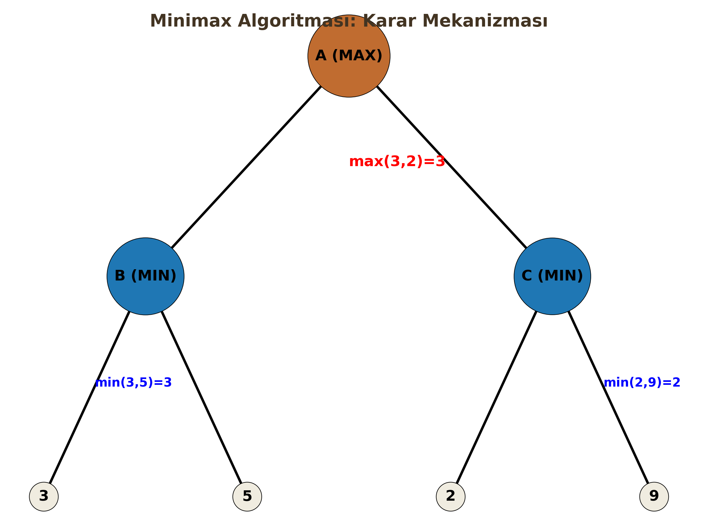

# Yapay Zekada Arama Algoritmaları

Yapay Zeka problemlerinin çoğu (satranç oynamak, rota oluşturmak, puzzle çözmek) aslında birer "Arama Problemi"dir. Bu derste, bir başlangıç durumundan hedef duruma ulaşmak için kullanılan temel algoritmaları inceleyeceğiz.

---

## 1. Breadth First Search (BFS - Sığ Öncelikli Arama)

### a) Tanım ve Çalışma Mantığı
Ağacı katman katman (level-by-level) tarayan algoritmadır. Başlangıç düğümüne en yakın olan tüm komşuları ziyaret etmeden, bir alt derinliğe inmez. "Sığdan derine" doğru ilerler.

### b) Veri Yapısı
**FIFO (First-In First-Out) Queue** (Kuyruk) kullanılır. İlk giren düğüm, ilk genişletilir.

### c) Karmaşıklık Analizi
* $b$: Dallanma faktörü (Branching factor - bir düğümün ortalama çocuk sayısı)
* $d$: En sığ çözümün derinliği (Depth)

* **Zaman Karmaşıklığı (Time):** $O(b^d)$
* **Bellek Karmaşıklığı (Space):** $O(b^d)$

!!! warning "Kritik Sınav Bilgisi"
    BFS'nin en büyük problemi **Bellek (Space)** kullanımıdır. Derinlik arttıkça kuyrukta tutulması gereken düğüm sayısı üstel olarak artar ve bellek taşmasına (Stack/Heap Overflow) neden olur.

### d) Avantaj/Dezavantaj

| Avantajlar | Dezavantajlar |
| :--- | :--- |
| **Complete (Tam):** Çözüm varsa mutlaka bulur. | **Yüksek Bellek:** Tüm katmanı hafızada tutmak zorundadır. |
| **Optimal:** Adım maliyetleri eşitse (örn: hepsi 1 birim) en kısa yolu garanti eder. | Derin hedeflerde çok yavaştır. |

---

## 2. Depth First Search (DFS - Derin Öncelikli Arama)

### a) Tanım ve Çalışma Mantığı
Bir daldan gidebildiği kadar derine iner. Çıkmaz sokağa (leaf node) ulaştığında veya hedefi bulamadığında, bir önceki düğüme geri döner (backtracking) ve diğer dalı dener.

### b) Veri Yapısı
**LIFO (Last-In First-Out) Stack** (Yığın) kullanılır. Genellikle "Recursive" (Özyinelemeli) fonksiyonlarla uygulanır.

### c) Karmaşıklık Analizi
* $m$: Ağacın maksimum derinliği

* **Zaman Karmaşıklığı:** $O(b^m)$
* **Bellek Karmaşıklığı:** $O(b \cdot m)$ (Lineer - En büyük artısı budur!)

!!! note "Algoritma Mantığı"
    DFS sadece o an üzerinde çalıştığı dalı (path) hafızada tutar. Bu yüzden BFS'ye göre bellek dostudur.

### d) Avantaj/Dezavantaj

| Avantajlar | Dezavantajlar |
| :--- | :--- |
| **Düşük Bellek:** Sadece $b \cdot m$ kadar alan harcar. | **Complete Değildir:** Sonsuz derinlikli veya döngülü ağaçlarda kaybolabilir. |
| Şanslıysa hedefi BFS'den çok daha hızlı bulabilir. | **Optimal Değildir:** Bulduğu ilk çözüm en kısa yol olmayabilir. |

---

## 3. Iterative Deepening DFS (ID-DFS)

### a) Tanım ve Çalışma Mantığı
BFS'nin "Optimalite" özelliğini DFS'nin "Düşük Bellek" avantajıyla birleştiren hibrit bir yöntemdir.
DFS'yi önce Limit=0, sonra Limit=1, Limit=2... şeklinde derinlik sınırını artırarak tekrar tekrar çalıştırır.

### b) Veri Yapısı
Limitli DFS kullandığı için **LIFO Stack** kullanır.

### c) Karmaşıklık Analizi
* **Zaman:** $O(b^d)$ (BFS ile aynıdır, tekrar tekrar taramak asimptotik olarak sonucu değiştirmez).
* **Bellek:** $O(b \cdot d)$ (DFS gibi lineerdir).

!!! warning "Kritik Sınav Bilgisi"
    "Sürekli baştan başlamak zaman kaybı değil mi?" sorusu sıkça gelir. Cevap: Hayır. Çünkü üstel büyüyen bir ağaçta ($b^d$), düğümlerin büyük çoğunluğu en alt kattadır. Üst katları tekrar tekrar ziyaret etmenin maliyeti ihmal edilebilir düzeydedir.

---

## 4. Uniform Cost Search (UCS)

### a) Tanım ve Çalışma Mantığı
BFS'nin maliyetli graflar için genelleştirilmiş halidir. Sadece adım sayısına değil, **toplam yol maliyetine ($g(n)$)** bakar. Her zaman "kümülatif maliyeti en düşük" olan düğümü genişletir.

### b) Veri Yapısı
**Priority Queue** (Öncelik Kuyruğu) kullanılır. Kuyruk, düğümlerin $g(n)$ (başlangıçtan o ana kadarki maliyet) değerine göre küçükten büyüğe sıralı tutulur.

### c) Karmaşıklık Analizi
* $C^*$: Optimal çözümün maliyeti
* $\epsilon$: Minimum kenar maliyeti

* **Zaman/Bellek:** $O(b^{C^*/\epsilon})$

### d) Avantaj/Dezavantaj

| Avantajlar | Dezavantajlar |
| :--- | :--- |
| **Optimal:** Her türlü pozitif kenar maliyetinde en ucuz yolu bulur. | Hedefin yönünü bilmez, her yöne eşit yayılır (Kör arama). |
| **Complete:** (Maliyetler pozitifse). | Bellek kullanımı yüksektir. |

---

## 5. A* (A-Star) Search

### a) Tanım ve Çalışma Mantığı
Bilgilendirilmiş (Informed) arama algoritmalarının kralıdır. Hem geçmiş maliyeti ($g(n)$) hem de hedefe kalan tahmini mesafeyi ($h(n)$) hesaba katar.

$$f(n) = g(n) + h(n)$$

* $g(n)$: Başlangıçtan $n$ düğümüne kadar olan gerçek maliyet.
* $h(n)$: $n$ düğümünden hedefe olan tahmini maliyet (Heuristic).

### b) Veri Yapısı
**Priority Queue**. Düğümler $f(n)$ değerine göre sıralanır.

### c) Heuristic ve "Admissible" Şartı

A\*'ın optimal çözüm bulabilmesi için Heuristic fonksiyon ($h(n)$) **Admissible (Kabul Edilebilir)** olmalıdır.

**Şart:** $h(n) \le h^*(n)$

Yani; tahminimiz ($h(n)$), asla gerçek maliyetten ($h^*(n)$) büyük olmamalıdır. (Asla "kötümser" olma, yolu olduğundan uzun sanma).

!!! warning "Kritik Sınav Bilgisi"
    Eğer $h(n) = 0$ alırsanız, A* algoritması **UCS** algoritmasına dönüşür.
    Eğer $h(n)$ inadmissible (aşırı büyük) olursa, A* optimalite özelliğini kaybeder ama daha hızlı çalışabilir.

---

## 6. Minimax ve Alpha-Beta Pruning

### a) Tanım ve Çalışma Mantığı
Satranç, XOX gibi karşılıklı, sıfır toplamlı (zero-sum) oyunlarda kullanılır.
* **MAX Oyuncusu:** Skoru maksimize etmeye çalışır (Biz).
* **MIN Oyuncusu:** Skoru minimize etmeye çalışır (Rakip).

### b) Alpha-Beta Budaması (Pruning)

Minimax ağacı çok büyük olduğu için, sonucu değiştirmeyecek gereksiz dalların kesilmesidir.

* **$\alpha$ (Alpha):** MAX için o ana kadar bulunan en iyi (en yüksek) seçenek.
* **$\beta$ (Beta):** MIN için o ana kadar bulunan en iyi (en düşük) seçenek.

!!! note "Algoritma Mantığı"
    Eğer bir dalda $\alpha \ge \beta$ durumu oluşursa, o dalın geri kalanına bakmaya gerek yoktur (Pruning). Çünkü rasyonel bir rakip o dalı zaten seçmeyecektir.

---

## ÖZET: Karşılaştırma Tablosu

Sınavda en çok puan getirecek tablo budur:

| Algoritma | Zaman Karmaşıklığı | Bellek Karmaşıklığı | Optimal mi? | Complete (Tam) mi? |
| :--- | :--- | :--- | :--- | :--- |
| **BFS** | $O(b^d)$ | $O(b^d)$ (Kötü) | Evet (Birim maliyette) | Evet |
| **DFS** | $O(b^m)$ | $O(b \cdot m)$ (İyi) | Hayır | Hayır (Sonsuz döngü riski) |
| **ID-DFS** | $O(b^d)$ | $O(b \cdot d)$ (İyi) | Evet (Birim maliyette) | Evet |
| **UCS** | $O(b^{C^*/\epsilon})$ | $O(b^{C^*/\epsilon})$ | Evet (Genel) | Evet |
| **A*** | Heuristic'e bağlı | Heuristic'e bağlı | Evet ($h(n)$ admissible ise) | Evet |

* **$b$:** Dallanma faktörü
* **$d$:** Çözüm derinliği
* **$m$:** Maksimum ağaç derinliği