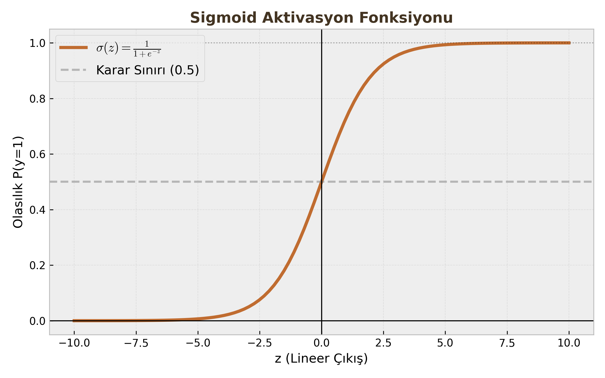

# Makine Öğrenmesi - Lojistik Regresyon (Logistic Regression)

Yapay Zeka ve Derin Öğrenme'nin "Merhaba Dünya"sı sayılan Lojistik Regresyon, isminde "Regresyon" geçmesine rağmen, aslında bir **Sınıflandırma (Classification)** algoritmasıdır. Özellikle İkili Sınıflandırma (Binary Classification - 0 veya 1) problemlerinde kullanılır.

---

## A. Temel Yapı ve Sigmoid Fonksiyonu

### Neden "Regresyon" Deniyor?
Çünkü algoritmanın kalbinde Lineer Regresyon yatar. Lojistik Regresyon, Lineer Regresyonun çıktısını alır ve bir olasılık değerine dönüştürür.

### 1. Lineer Model (Weighted Sum)
Önce girdiler ($x$), ağırlıklar ($w$) ile çarpılır ve bir sapma değeri ($b$ - bias) eklenir. Bu kısım saf matematiktir:

$$z = w^T x + b = w_1 x_1 + w_2 x_2 + ... + b$$

Burada $z$, $-\infty$ ile $+\infty$ arasında herhangi bir değer alabilir. Ancak biz "Sınıflandırma" yapmak (yani 0 ile 1 arasında bir ihtimal bulmak) istiyoruz.

### 2. Sigmoid Aktivasyon Fonksiyonu ($\sigma(z)$)
Lineer modelin çıktısı ($z$), **Sigmoid** (veya Lojistik) fonksiyonundan geçirilerek "ezilir" (squashing).

**Formül:**
$$\sigma(z) = \frac{1}{1 + e^{-z}}$$

**Özellikleri:**

* $z \to \infty$ iken $\sigma(z) \to 1$
* $z \to -\infty$ iken $\sigma(z) \to 0$
* $z = 0$ iken $\sigma(z) = 0.5$

Böylece çıktımız ($\hat{y}$), "Girdinin 1. sınıfa ait olma olasılığı"nı ($P(y=1|x)$) verir.

### 3. Karar Sınırı (Decision Boundary)
Model bir olasılık üretir (Örn: 0.85). Kesin bir sınıf (0 veya 1) atamak için bir eşik değeri (Threshold) kullanırız. Genellikle 0.5 seçilir.

* $\hat{y} \ge 0.5 \implies y = 1$ (Pozitif Sınıf)
* $\hat{y} < 0.5 \implies y = 0$ (Negatif Sınıf)

!!! note "Öğrenci Notu"
    Sigmoid fonksiyonunun türevi, optimizasyon sırasında çok işimize yarar:
    $\sigma'(z) = \sigma(z)(1 - \sigma(z))$. Bu sade yapı işlem yükünü hafifletir.

---

## B. Maliyet Fonksiyonları (Cost Functions)

Modelin ne kadar hata yaptığını ölçmemiz gerekir. Lineer regresyonda kullandığımız MSE (Hata Kareler Ortalaması) burada işe yaramaz.

### Neden MSE Kullanmıyoruz?
Sigmoid fonksiyonunun yapısından dolayı, eğer MSE kullanırsak maliyet fonksiyonu "Non-Convex" (Dışbükey olmayan) bir şekil alır. Yani bir sürü yerel minimum (local minima) oluşur ve Gradient Descent global minimumu bulamaz.

### Çözüm: Cross-Entropy Loss (Log-Loss)
Olasılık (Likelihood) maksimizasyonu prensibine dayanır. İstenen sınıfa verdiğimiz olasılığın logaritmasını maksimize etmeye (veya hatayı minimize etmeye) çalışırız.

**Tek bir örnek için Maliyet:**
$$L(\hat{y}, y) = -(y \log(\hat{y}) + (1-y) \log(1-\hat{y}))$$

**Tüm veri seti için Ortalama Maliyet ($J(w)$):**
$$J(w) = - \frac{1}{m} \sum_{i=1}^{m} [y^{(i)} \log(\hat{y}^{(i)}) + (1-y^{(i)}) \log(1-\hat{y}^{(i)})]$$

* Eğer $y=1$ ise; formül $-\log(\hat{y})$ olur. $\hat{y}$ 1'e yaklaştıkça hata 0'a iner.
* Eğer $y=0$ ise; formül $-\log(1-\hat{y})$ olur. $\hat{y}$ 0'a yaklaştıkça hata 0'a iner.

---

## C. Optimizasyon Yöntemleri (Ağırlık Güncelleme)

Maliyet fonksiyonunu ($J(w)$) minimize eden en iyi ağırlıkları ($w$) bulmak için iki temel yöntem vardır.

### 1. Gradient Descent (Gradyan İniş)
En yaygın yöntemdir. Maliyet fonksiyonunun türevini (eğimini) alarak, eğimin tersi yönünde küçük adımlar atarız.

**Güncelleme Kuralı:**
$$w_{yeni} = w_{eski} - \alpha \nabla J(w)$$

* $\alpha$: Öğrenme oranı (Learning Rate).
* $\nabla J$: Gradyan (Türev) vektörü.

Lojistik regresyon için türev şaşırtıcı derecede sadedir:
$$\frac{\partial J}{\partial w} = \frac{1}{m} \sum ( \hat{y}^{(i)} - y^{(i)} ) x^{(i)}$$

### 2. IRLS / Newton-Raphson Yöntemi
Daha ileri düzey bir optimizasyondur. Sadece eğime (1. türev) değil, eğimin değişim hızına (2. türev / Eğrilik) da bakar.

**Özellikleri:**

* **Hessian Matrisi ($H$):** İkinci türevlerden oluşan matristir.
* **Hız:** Gradient Descent'e göre çok daha az adımda (iterasyonda) sonuca ulaşır.
* **Maliyet:** Hessian matrisinin tersini ($H^{-1}$) almak hesaplama açısından çok pahalıdır ($O(D^3)$). Bu yüzden çok büyük veri setlerinde tercih edilmez.

**Güncelleme Kuralı:**
$$w_{yeni} = w_{eski} - H^{-1} \nabla J(w)$$

Bu yönteme, Lojistik Regresyon bağlamında **IRLS (Iterative Reweighted Least Squares)** adı da verilir.

!!! warning "Kritik Sınav Bilgisi"
    Vize sorularında "Gradient Descent ile Newton Yöntemi arasındaki fark nedir?" sorusu klasiktir.
    Cevap: Gradient Descent 1. türevi kullanır (yavaştır ama ucuzdur), Newton yöntemi 2. türevi (Hessian) kullanır (hızlıdır ama işlem maliyeti yüksektir).

---

## D. MLP (Multi-Layer Perceptron) Bağlantısı

Bu dersin en önemli aydınlanma anı şurasıdır:

**Lojistik Regresyon, aslında tek bir nörondan oluşan bir Sinir Ağıdır.**

Eğer bir Yapay Sinir Ağı (YSA) çizerseniz ve bu ağda:
1.  Sadece girdi katmanı ve çıktı katmanı varsa (Gizli katman yoksa),
2.  Çıktı nöronunda aktivasyon fonksiyonu olarak **Sigmoid** kullanılıyorsa,
3.  Loss fonksiyonu olarak **Cross-Entropy** kullanılıyorsa,

Bu yapı matematiksel olarak Lojistik Regresyon ile **birebir aynıdır**. Bu yüzden Lojistik Regresyon, Derin Öğrenmeye girişin kapısıdır.