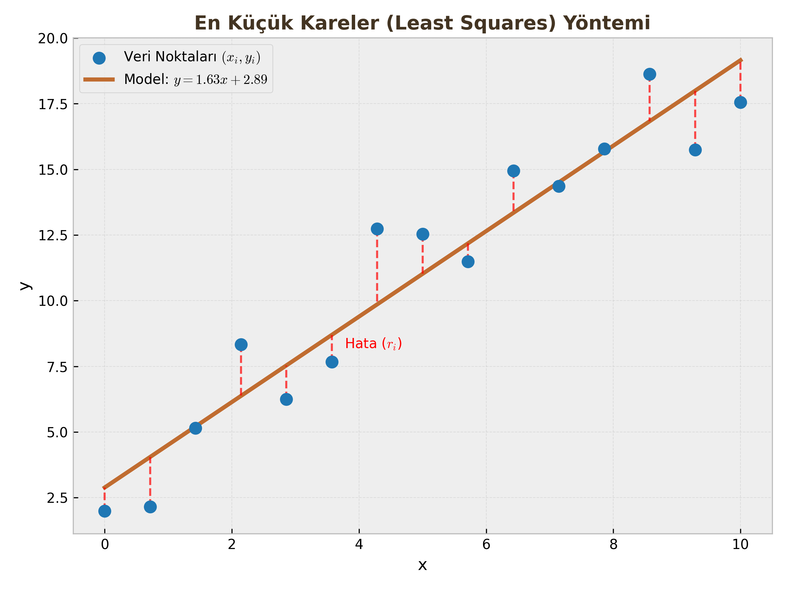

# Matematiksel Optimizasyonun Temelleri 

Yapay Zeka modellerinin (Lojistik Regresyon, Sinir Ağları vb.) öğrenmesi, aslında birer optimizasyon işlemidir. Bu derste "En iyi parametreleri nasıl buluruz?" sorusunun matematiksel altyapısını kuracağız.

---

## 1. Introduction to Mathematical Optimization (Giriş)

Optimizasyon, belirli kısıtlar altında bir amacı (maliyeti, süreyi, hatayı) en aza indiren (veya karı maksimize eden) çözümün bulunmasıdır.

### Arama vs. Optimizasyon
Daha önce gördüğümüz Arama Algoritmaları (BFS, DFS, A*) ile Matematiksel Optimizasyon arasında temel farklar vardır:

* **Arama Problemleri:** Genellikle **Ayrık (Discrete)** ve **Sonlu (Finite)** uzaylarda çalışır. Ancak durum sayısı arttıkça karmaşıklık **Üstel (Exponential)** artar. (Örn: Satranç tahtası).
* **Matematiksel Programlama:** Genellikle **Sürekli (Continuous)** değişkenlerle çalışır. Değişkenler reel sayılardır ($x \in \mathbb{R}^n$).

### Optimizasyon Probleminin Resmi Tanımı
Standart bir optimizasyon problemi şu formatta yazılır:

$$
\begin{align} 
\text{minimize} \quad & f_0(x) \\ 
\text{subject to} \quad & f_i(x) \le b_i, \quad i = 1, \dots, m 
\end{align}
$$

Burada:

* $x = (x_1, \dots, x_n)$: Optimizasyon değişkenleri vektörü.
* $f_0(x)$: **Amaç Fonksiyonu (Objective Function)**. (Minimize etmek istediğimiz maliyet).
* $f_i(x)$: **Kısıt Fonksiyonları (Constraints)**.
* $b_i$: Kısıt sınırları.

**Temel Kavramlar:**

* **Uygulanabilir Bölge (Feasible Region):** Tüm kısıtları ($f_i(x) \le b_i$) sağlayan $x$ değerlerinin oluşturduğu kümedir.
* **Optimal Çözüm ($x^*$):** Uygulanabilir bölge içinde $f_0(x)$ değerini en küçük yapan $x$ vektörüdür.

---

## 2. Optimization Problems (Problem Türleri)

Optimizasyon dünyasında en kritik ayrım şudur: Problem **Konveks (Dışbükey)** mi, yoksa **Konveks Değil (Non-Convex)** mi?

### A. Konveks Küme (Convex Set)
Bir kümenin konveks olması için şu şartı sağlaması gerekir:
> "Küme içindeki herhangi iki noktayı birleştiren düz çizgi, tamamen kümenin içinde kalmalıdır."

* **Örnek:** Daire içi, küp içi, üçgen içi konvekstir.
* **Konveks Olmayan:** Hilal şekli (uçları birleştiren çizgi boşluktan geçer), simit şekli.

### B. Konveks Fonksiyon
Bir fonksiyonun konveks olması, grafiğinin bir **"Kase" (Bowl)** veya **"Vadi"** şeklinde olması demektir.

**Tanım:** Fonksiyon eğrisinin üzerindeki herhangi iki noktayı birleştiren kiriş (chord), fonksiyonun üzerinde kalıyorsa o fonksiyon konvekstir.

$$f(\alpha x + (1-\alpha)y) \le \alpha f(x) + (1-\alpha)f(y)$$

!!! warning "Kritik Sınav Bilgisi: Neden Konvekslik Önemli?"
    Konveks bir fonksiyonda **Yerel Minimum (Local Minimum)** aynı zamanda **Global Minimum**dur. Yani, çukru bulduğunuzda "Acaba daha derin bir çukur var mı?" diye endişelenmenize gerek yoktur. Non-Convex problemlerde (Sinir Ağları gibi) ise birçok yerel tuzak vardır.

### C. Lineer Eşitsizlikler ve Kesişimler

Her lineer kısıt ($a^T x \le b$), uzayı ikiye böler ve bir **Yarı-Uzay (Half-Space)** tanımlar.

* Yarı-uzaylar konveks kümelerdir.
* Konveks kümelerin kesişimi de konvekstir.
* Bu nedenle, lineer kısıtlarla tanımlanan uygulanabilir bölge (poliedron) her zaman konvekstir.

---

## 3. Application: Least Squares (En Küçük Kareler)

Optimizasyonun mühendislikteki en yaygın uygulamasıdır. Bir veri bulutuna en uygun doğruyu veya eğriyi uydurma (Curve Fitting) işlemidir.

### Problem Tanımı
Elimizde $(x_i, y_i)$ şeklinde veri noktaları var. Biz bu noktaları en iyi temsil eden $y = ax + b$ doğrusunu arıyoruz.

* **Değişkenler:** $a$ (eğim) ve $b$ (kesim noktası).
* **Model Tahmini:** $\hat{y}_i = ax_i + b$

### Hata (Residual) Fonksiyonu
Her bir nokta için gerçek değer ile tahmin arasındaki farka "artık" (residual) denir:
$$r_i = y_i - (ax_i + b)$$

### Amaç Fonksiyonu
Amacımız hataları sıfırlamak değil (imkansız olabilir), hataların büyüklüğünü minimize etmektir. Negatif hatalar pozitifleri götürmesin diye **kareleri toplamını** minimize ederiz.

$$\text{minimize} \quad \sum_{i=1}^{m} r_i^2 = \sum_{i=1}^{m} (y_i - (ax_i + b))^2$$

Bu fonksiyon ($J(a, b)$), parametrelere göre **Konveks (Parabolik)** bir yapıdadır. Yani tek bir dibi vardır.

### Çözüm Yöntemi
Kalkülüs kullanarak türev alır ve sıfıra eşitleriz:

1.  Hata fonksiyonunun $a$'ya göre kısmi türevi alınır ve 0'a eşitlenir: $\frac{\partial J}{\partial a} = 0$
2.  Hata fonksiyonunun $b$'ye göre kısmi türevi alınır ve 0'a eşitlenir: $\frac{\partial J}{\partial b} = 0$

Bu işlem bize kapalı formda (Analytical Solution) optimal $a^*$ ve $b^*$ değerlerini verir.

!!! note "Öğrenci Notu"
    Neden Mutlak Değer ($|r_i|$) değil de Kare ($r_i^2$) kullanıyoruz?
    Çünkü kare fonksiyonu her noktada türevi alınabilir (differentiable) bir fonksiyondur. Mutlak değer fonksiyonunun $0$ noktasında türevi yoktur (sivri uç), bu da optimizasyonu zorlaştırır.