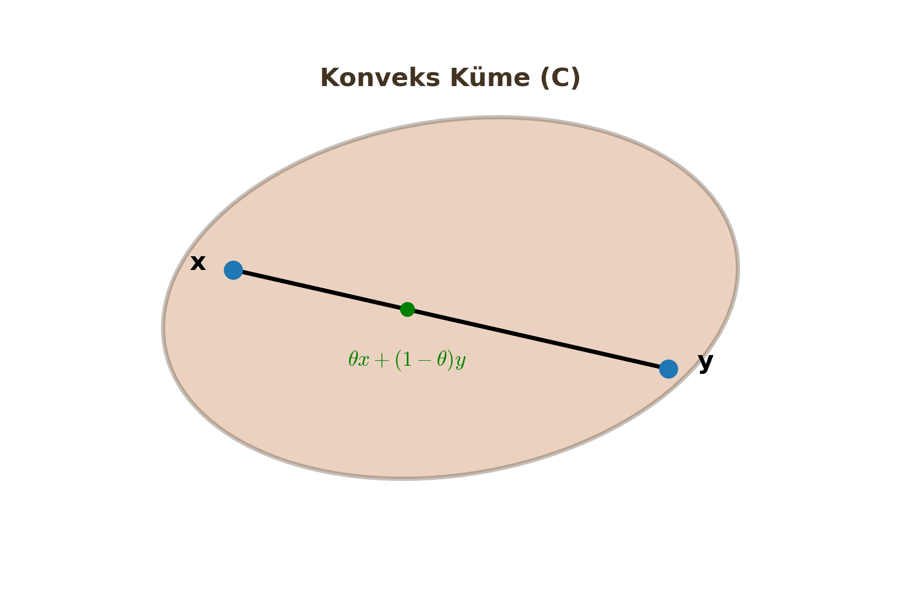

# Konvekslik – Fonksiyonlar, Kümeler ve Özellikleri

Yapay zeka modellerini eğitirken (optimize ederken) en büyük korkumuz "Yerel Minimum" (Local Minima) tuzaklarına düşmektir. Ancak probleminiz **Konveks** ise korkmanıza gerek yoktur. Bu derste konveksliğin matematiğini ve geometrisini inceleyeceğiz.

---

## 1. Convex Sets (Konveks Kümeler)

Konveks küme, optimizasyon probleminin "Uygulanabilir Bölgesi"ni (Feasible Region) tanımlar.

### Temel Tanım
Bir kümenin ($C$) konveks olması için geometrik kural şudur:
> "Küme içindeki herhangi iki noktayı rastgele seçin. Bu iki noktayı birleştiren düz çizgi (doğru parçası), tamamen kümenin içinde kalmalıdır. Dışarı taşamaz."

### Matematiksel Şart
Eğer $x$ ve $y$ noktaları $C$ kümesinin elemanıysa ($x, y \in C$) ve $\theta$, 0 ile 1 arasında bir karıştırma katsayısıysa ($0 \le \theta \le 1$);

$$\theta x + (1-\theta)y \in C$$

Burada $\theta x + (1-\theta)y$ ifadesi, $x$ ile $y$ arasındaki doğru parçasını temsil eder.

### Önemli Konveks Kümeler
Sınavlarda "Aşağıdakilerden hangisi konveks kümedir?" sorusuyla sık karşılaşılır.

1.  **Lineer Eşitsizlikler (Yarı Uzaylar):**
    $$Ax \le b$$
    Bir uzayı bıçakla ikiye kestiğinizi düşünün. Kalan parça (Yarı Uzay) her zaman konvekstir.
2.  **Lineer Eşitlikler (Hiper Düzlemler):**
    $$Ax = b$$
    Doğrular, düzlemler ve hiper düzlemler konvekstir.
3.  **Kesişim Özelliği (Intersection):**
    İki veya daha fazla konveks kümenin kesişimi, **her zaman konvekstir**. (Örn: İki dairenin kesişim bölgesi).
    $$C_1 \cap C_2 \implies \text{Konveks}$$

!!! warning "Kritik Sınav Bilgisi"
    Konveks kümelerin **Birleşimi (Union)** genellikle konveks **DEĞİLDİR**. İki ayrı daireyi birleştirirseniz, birinden diğerine çizilen çizgi boşluktan geçer.

---

## 2. Convex Functions (Konveks Fonksiyonlar)

Konveks fonksiyon, maliyet (loss) fonksiyonumuzun şeklini tanımlar. Hedefimiz "Çanak" (Bowl) şeklinde bir fonksiyon elde etmektir.

### Tanım
Bir fonksiyonun ($f$) grafiğinin üzerindeki iki noktayı birleştiren kiriş (chord), fonksiyon eğrisinin **üzerinde veya yukarısında** kalıyorsa, o fonksiyon konvekstir.

### Matematiksel Şart (Jensen Eşitsizliği Temeli)
Her $x, y$ ve $0 \le \theta \le 1$ için:

$$f(\theta x + (1-\theta)y) \le \theta f(x) + (1-\theta)f(y)$$

* **Sol Taraf:** Ara noktanın fonksiyon değeri (Eğri üzerindeki nokta).
* **Sağ Taraf:** Fonksiyon değerlerinin ağırlıklı ortalaması (Kiriş üzerindeki nokta).

### Özel Durumlar
1.  **Konkav Fonksiyon (Concave):**
    Eğer $-f(x)$ konveks ise, $f(x)$ konkavdır. (Tersi dönmüş çanak, tepe şekli).
    $$f(\theta x + (1-\theta)y) \ge \theta f(x) + (1-\theta)f(y)$$

2.  **Afin Fonksiyonlar (Doğrusal):**
    $$f(x) = Ax + b$$
    Hem konveks hem de konkav olan tek fonksiyon türüdür. (Kiriş, eğrinin tam üstüne düşer).

---

## 3. Testing for Convexity (Konvekslik Testleri)

Bir fonksiyonun konveks olup olmadığını grafiğini çizmeden nasıl anlarız? Türev kullanarak.

### A. Birinci Derece Türev Şartı (1st Order Condition)
Konveks bir fonksiyon, her noktada kendi teğet doğrusunun (tangent line) **yukarısında** kalır.

$$f(y) \ge f(x) + \nabla f(x)^T (y-x)$$

Burada $f(x) + \nabla f(x)^T (y-x)$, $x$ noktasındaki Taylor açılımıdır (Teğet Düzlemi).

### B. İkinci Derece Türev Şartı (2nd Order Condition) - EN ÖNEMLİSİ
Fonksiyonun eğriliğine (Curvature) bakarız.

**1. Tek Değişkenli Fonksiyonlar İçin ($f: \mathbb{R} \to \mathbb{R}$):**
İkinci türev negatif olmamalıdır.
$$f''(x) \ge 0$$
(Eğim sürekli artıyor, yani grafik yukarı kıvrılıyor).

**2. Çok Değişkenli Fonksiyonlar İçin ($f: \mathbb{R}^n \to \mathbb{R}$):**
**Hessian Matrisi ($\nabla^2 f(x)$)** incelenir. Bu matris **Pozitif Yarı Tanımlı (Positive Semi-Definite - PSD)** olmalıdır.

**PSD Şartı:** Herhangi bir $z$ vektörü için;
$$z^T \nabla^2 f(x) z \ge 0$$

!!! note "Öğrenci Notu: Hessian PSD Nasıl Anlaşılır?"
    Sınavda $2 \times 2$ bir Hessian matrisi verilirse, PSD olduğunu anlamak için:
    1. Tüm Köşegen (Diagonal) elemanlar $\ge 0$ olmalı.
    2. Determinant $\ge 0$ olmalı.
    3. (Veya) Tüm Özdeğerler (Eigenvalues) $\ge 0$ olmalı.

---

## 4. Konveks Optimizasyonun Kutsal Kasesi

Neden konvekslikle bu kadar uğraşıyoruz? Çünkü optimizasyon dünyasının en güçlü teoremi buradadır.

### Tanımlar
* **Lokal Optimum:** Komşuları arasında en iyi olan çözüm.
* **Global Optimum:** Tüm uzaydaki en iyi çözüm.

Non-convex problemlerde (dağlar ve vadiler) birçok yerel dip nokta olabilir ve algoritmamız buralara takılabilir.

### Temel Teorem
> **"Konveks bir optimizasyon probleminde (Amaç fonksiyonu konveks + Kısıt kümesi konveks), bulunan herhangi bir lokal optimum, aynı zamanda GLOBAL OPTIMUMDUR."**

Bu demektir ki; eğer probleminizin konveks olduğunu ispatlarsanız, Gradient Descent ile bulduğunuz sonucun "En iyi sonuç" olduğundan %100 emin olabilirsiniz.

### Özet Tablo

| Özellik | Konveks Problem | Non-Convex Problem |
| :--- | :--- | :--- |
| **Minimum Sayısı** | Tek (veya bitişik düzlük) | Birden fazla olabilir |
| **Lokal vs Global** | Lokal = Global | Lokal $\neq$ Global olabilir |
| **Çözüm Zorluğu** | Kolay (Polinomsal Zaman) | Zor (NP-Hard olabilir) |
| **Örnek** | Lojistik Regresyon, SVM | Derin Sinir Ağları (Deep NN) |