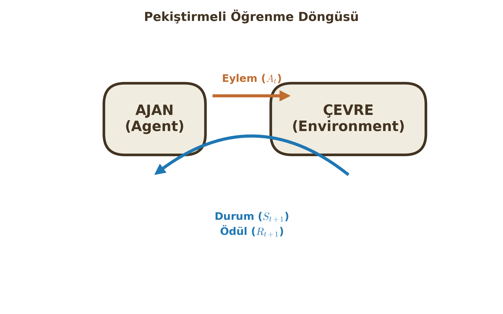
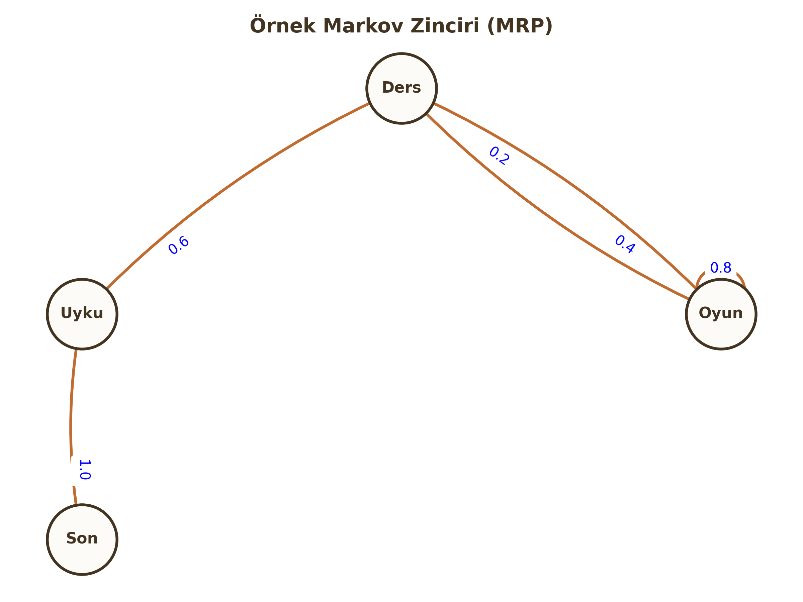

# Pekiştirmeli Öğrenme (Reinforcement Learning) – Temel Yapı

Şimdiye kadar gözetimli (etiketli veri ile) öğrenmeyi gördük. Pekiştirmeli Öğrenme (RL) ise çok farklıdır: Burada bir öğretmen yoktur, sadece yapılan eylemlere karşılık alınan **Ödül (Reward)** veya **Ceza** vardır. Ajan, deneme-yanılma yoluyla hayatta kalmayı öğrenir.

---

## 1. Sequential Decision Making & Reward Hypothesis

RL, sıradan bir sınıflandırma problemi değildir; bir **Sıralı Karar Verme (Sequential Decision Making)** problemidir.

### Ajan-Çevre Döngüsü (The RL Loop)
Sistem iki ana oyuncudan oluşur: **Ajan (Agent)** ve **Çevre (Environment)**.
Her $t$ zaman adımında:

1.  Ajan, çevrenin durumunu ($S_t$) gözlemler.
2.  Buna göre bir eylem ($A_t$) seçer.
3.  Çevre, bu eyleme tepki olarak ajana bir sonraki durumu ($S_{t+1}$) ve bir sayısal ödül ($R_{t+1}$) verir.

### Reward Hypothesis (Ödül Hipotezi)
RL'in temel felsefesi şudur:
> "Başarmak istediğimiz tüm hedefler, beklenen kümülatif ödülün (toplam getiri) maksimizasyonu olarak ifade edilebilir."

### Return (Getiri - $G_t$) ve İskonto Katsayısı ($\gamma$)
Ajanın amacı anlık ödülü değil, uzun vadeli toplam ödülü ($G_t$) maksimize etmektir.

$$G_t = R_{t+1} + \gamma R_{t+2} + \gamma^2 R_{t+3} + \dots = \sum_{k=0}^{\infty} \gamma^k R_{t+k+1}$$

**Neden $\gamma$ (Discount Factor) Kullanıyoruz?**

$\gamma \in [0, 1]$ aralığında bir sayıdır.

1.  **Matematiksel Yakınsama:** Sonsuz adımda ödüllerin toplamının sonsuza gitmesini engeller.
2.  **Belirsizlik:** Gelecek belirsizdir; şu anki ödül, gelecekteki vaatten daha değerlidir (Paranın zaman değeri gibi).

!!! warning "Kritik Sınav Bilgisi"
    * $\gamma = 0$: Ajan "Miyop"tur. Sadece şu anki ödüle ($R_{t+1}$) bakar.
    * $\gamma \to 1$: Ajan "İleri Görüşlü"dür. Gelecekteki ödüller de şimdikiler kadar önemlidir.

---

## 2. States, Histories and Policies

### History ($H_t$) vs State ($S_t$)
* **History (Tarihçe):** Başlangıçtan bugüne kadar olan tüm gözlem, eylem ve ödüllerin ham dizisidir.
    $$H_t = O_1, R_1, A_1, \dots, A_{t-1}, O_t, R_t$$
* **State (Durum):** Tarihçenin, geleceği belirlemek için kullanılan özetlenmiş halidir.

### The Markov Property (Markov Özelliği)
RL'de kullanılan durumlar genellikle "Markov" özelliğine sahip kabul edilir.

> **Tanım:** "Gelecek, geçmişten bağımsızdır; sadece şimdiki duruma bağlıdır."

$$P[S_{t+1} | S_t] = P[S_{t+1} | S_1, \dots, S_t]$$

Yani; $S_t$ durumundaysanız, buraya nasıl geldiğinizin (History) bir önemi yoktur. Yapılacak hamle için $S_t$ tüm bilgiyi içerir.

### Politika (Policy - $\pi$)

Ajanın beynidir. Bir durumda hangi eylemi yapacağını belirleyen fonksiyondur.

1.  **Deterministik Politika:** Her durum için tek bir eylem üretir.
    $$a = \pi(s)$$
2.  **Stokastik Politika:** Eylemlerin bir olasılık dağılımını üretir. (Örn: %70 ileri, %30 sağa).
    $$\pi(a|s) = P[A_t = a | S_t = s]$$

---

## 3. Markov Processes (MRP & MDP)

RL problemlerini matematiksel olarak modellemek için Markov süreçlerini kullanırız.

### A. Markov Reward Process (MRP)
Sadece durumların ve ödüllerin olduğu, **Eylemsiz (No Action)** süreçtir. Bir şişenin nehirde sürüklenmesi gibidir; kontrol sizde değildir.

Bileşenler: $ S, P, R, \gamma $

* $S$: Durum uzayı.
* $P$: Geçiş Matrisi. $P_{ss'} = P[S_{t+1}=s' | S_t=s]$ (s'den s''e geçme olasılığı).
* $R$: Ödül fonksiyonu. $R_s = \mathbb{E}[R_{t+1} | S_t=s]$.
* $\gamma$: İskonto katsayısı.

**Durum Değer Fonksiyonu ($v(s)$):**
Bir $s$ durumunda bulunmanın ne kadar "değerli" olduğunu söyler.
$$v(s) = \mathbb{E} [G_t | S_t = s]$$

### B. Markov Decision Process (MDP)
MRP'ye **Ajan (Karar verici)** eklenmiş halidir. RL'in temelini oluşturur.

Bileşenler: $ S, A, P, R, \gamma $

* $A$: Eylem uzayı (Ajanın yapabileceği hareketler).

Artık geçişler ve ödüller sadece duruma değil, **seçilen eyleme** de bağlıdır:
$$P_{ss'}^a = P[S_{t+1}=s' | S_t=s, A_t=a]$$
$$R_s^a = \mathbb{E}[R_{t+1} | S_t=s, A_t=a]$$

!!! note "Öğrenci Notu"
    MDP'de amaç, toplam ödülü maksimize edecek en iyi politikayı ($\pi^*$) bulmaktır. MRP'de ise sadece süreci izler ve değerini hesaplarız.

---

## 4. Model-Based vs Model-Free RL

Bu ayrım, ajanın çevre hakkında ne bildiğiyle ilgilidir.

### Model-Based RL (Model Tabanlı)
Ajan, çevrenin nasıl çalıştığını bilir veya öğrenmeye çalışır.

* **Model:** Geçiş olasılıkları ($P$) ve ödül fonksiyonudur ($R$).
* Ajan, eylem yapmadan önce kafasında simülasyon yapabilir ("Eğer sağa gidersem %90 ihtimalle duvara çarparım" diyebilir).
* Bu işleme **Planlama (Planning)** denir. (Örn: Satranç).

### Model-Free RL (modelsiz)
Ajan çevrenin kurallarını ($P$ ve $R$) bilmez.

* Sadece deneyimleyerek (Trial-and-Error) öğrenir.
* "Burası tehlikeli" der ama nedenini (olasılıkları) matematiksel olarak bilmez.
* Q-Learning gibi popüler algoritmalar bu sınıftadır.