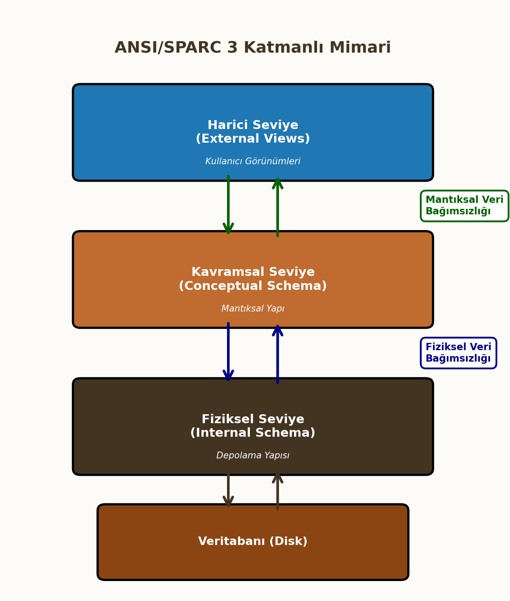

# Veri Tabanı Yönetim Sistemleri (VTYS) Giriş

Bu ders notları, Veri Tabanı Yönetim Sistemleri (VTYS) dersinin temel kavramlarını, mimarisini ve tasarım süreçlerini kapsamaktadır.

---

## 1. Giriş ve Temel Kavramlar

Veritabanı sistemlerinin temelini anlamak için öncelikle veri ve bilgi kavramlarını hiyerarşik bir yapıda incelemek gerekir.

### Veri ve Bilgi İlişkisi (DIKW Piramidi)

Veri yönetimi süreçlerinde bilgi hiyerarşisi **DIKW** (Data, Information, Knowledge, Wisdom) modeli ile tanımlanır.

1.  **Veri (Data):** Ham gerçeklerdir. İşlenmemiştir ve tek başına anlam ifade etmez. (Örn: `38`, `Mavi`).
2.  **Enformasyon (Information):** Verinin işlenmiş, ilişkilendirilmiş ve bağlam kazanmış halidir. (Örn: `Hava Sıcaklığı 38°C`).
3.  **Bilgi (Knowledge):** Enformasyonun deneyim, kurallar ve analizle birleşerek karar verme yetisine dönüşmesidir. (Örn: `38°C ateş yüksek kabul edilir`).
4.  **Bilgelik (Wisdom):** Bilginin ne zaman ve nasıl uygulanacağına dair üst düzey kavrayıştır.

  

### Veri Türleri

Veriler yapısal özelliklerine ve saklanma biçimlerine göre üç ana kategoride incelenir:

* **Yapısal Veri (Structured Data):** Belirli bir şeması ve formatı vardır. İlişkisel veritabanlarında (RDBMS) satır ve sütun formatında tutulur. (Örn: SQL Tabloları).
* **Yarı Yapısal Veri (Semi-Structured Data):** Tam bir tablo yapısı yoktur ancak etiketler (tags) ile hiyerarşi içerir. (Örn: JSON, XML, HTML).
* **Yapısal Olmayan Veri (Unstructured Data):** Belirli bir formatı yoktur. Sorgulanması ve analizi zordur. (Örn: Video, ses, metin belgeleri, PDF).

---

## 2. Dosyalama ve Veri Erişim Yaklaşımları

### Klasik Dosyalama
Veritabanı sistemlerinden önce, her uygulama kendi verisini işletim sistemi üzerindeki dosyalarda (txt, dat vb.) saklardı. Bu yaklaşım veri tekrarına, tutarsızlığa ve güvenlik açıklarına neden olmuştur.

### Erişim Yöntemleri
Veriye ulaşmak için kullanılan temel algoritmalar şunlardır:

1.  **Sıralı Erişim (Sequential Access):**
    * Veriye ulaşmak için önceki tüm kayıtların okunması gerekir.
    * Manyetik teyp mantığıdır.
    * Karmaşıklık: Ortalama $O(N)$.
2.  **Doğrudan Erişim (Direct Access):**
    * Kaydın adresi veya anahtarı bilindiğinde doğrudan o konuma gidilir.
    * Disk (HDD/SSD) ve RAM erişim mantığıdır. Index veya Hashing kullanılır.
    * Karmaşıklık: Genellikle $O(1)$ veya $O(\log N)$.

---

## 3. Bilgi Sistemleri ve VTYS'ye Giriş

### Bilgi Sistemleri ve Bileşenleri
Veriyi toplayan, saklayan, işleyen ve dağıtan sistemlerdir. 5 temel bileşeni vardır:

* **Donanım:** Fiziksel cihazlar (Sunucu, Disk).
* **Yazılım:** İşletim sistemi, VTYS.
* **Veri:** Sistemin hammaddesi.
* **Ağ:** İletişim altyapısı.
* **İnsan:** Kullanıcılar (DBA, Son Kullanıcı, Geliştirici).

### Veri Tabanı Temel Kavramlar
* **Veritabanı (Database):** Belirli bir amaca yönelik, birbiriyle ilişkili verilerin düzenli topluluğudur.
* **Mini Dünya (Universe of Discourse - UoD):** Veritabanının gerçek dünyada modellediği kısımdır (Örn: Üniversite DB için Öğrenci ve Dersler).

### Veri Tabanı Yönetim Sistemi (VTYS)
Veritabanlarını tanımlamak, oluşturmak ve yönetmek için kullanılan yazılımdır (Oracle, MySQL, PostgreSQL, SQL Server).

    

!!! warning "Sınav Bilgisi: Dosya Sistemi vs. VTYS"
    Aşağıdaki karşılaştırma tablosu sınavlar için kritiktir:

    | Özellik | Geleneksel Dosya Sistemi | VTYS (Veritabanı) |
    | :--- | :--- | :--- |
    | **Veri Tekrarı** | Yüksek (Redundancy) | Kontrol Altında (Normalization) |
    | **Tutarlılık** | Düşük | Yüksek (Consistency constraints) |
    | **Veri Paylaşımı** | Zor | Kolay (Concurrency Control) |
    | **Veri Bağımsızlığı** | Yok (Program-Data Dependence) | Var (Fiziksel/Mantıksal Bağımsızlık) |

---

## 4. VTYS Temel Bileşenleri

VTYS, kullanıcı ile veritabanı arasında bir arayüz sağlar ve aşağıdaki dilleri/modülleri içerir:

### Veritabanı Dilleri
1.  **DDL (Data Definition Language):** Veritabanı şemasını tanımlar.
    ```sql
    CREATE TABLE Ogrenci (No INT, Ad VARCHAR(50));
    ```
2.  **DML (Data Manipulation Language):** Veri üzerinde işlem yapar (CRUD).
    ```sql
    SELECT * FROM Ogrenci WHERE No = 1;
    ```
3.  **SQL (Structured Query Language):** İlişkisel veritabanları için standart dildir.
4.  **Genişletilmiş Programlama Dili:** SQL'e prosedürel özellikler katar (T-SQL, PL/SQL).

### Veritabanı Yöneticisi Alt Bileşenleri
* **Bellek Yöneticisi (Storage Manager):** Verinin diskte fiziksel saklanmasını yönetir.
* **Dosya Yöneticisi (File Manager):** Disk alanının tahsisi ve dosya yapılarını yönetir.
* **Tampon Yöneticisi (Buffer Manager):** Veriyi diskten RAM'e (Cache) getirir. Performans için kritiktir.
* **Hareket Yöneticisi (Transaction Manager):** İşlemlerin bütünlüğünü (ACID) ve eşzamanlılığı sağlar.

---

## 5. Veri Modelleri

Veri modeli, verinin mantıksal yapısını ve ilişkilerini belirleyen kurallar setidir.

### Veri Modeli Türleri
1.  **Hiyerarşik Model:** Ağaç yapısı (Tree). Ebeveyn-Çocuk ilişkisi (1:N). (Örn: IBM IMS).
2.  **Ağ Modeli:** Graf yapısı (Graph). Bir kaydın birden fazla ebeveyni olabilir.
3.  **İlişkisel Model (Relational):** Veriler 2 boyutlu tablolarda tutulur. Matematiksel küme teorisine dayanır.
4.  **Varlık-İlişki Modeli (ER Model):** Tasarım aşamasında kullanılan kavramsal modeldir.
5.  **Nesneye Yönelik Model (OODBMS):** Veriyi nesneler (object) olarak saklar.
6.  **NoSQL Modeller:** Büyük veri ve esneklik için geliştirilmiştir (Document, Key-Value, Graph, Columnar).

---

## 6. VTYS Mimarisi

Veri bağımsızlığını sağlamak için **ANSI/SPARC 3 Katmanlı Mimari** kullanılır.


### 3 Katmanlı Yapı
1.  **Harici Seviye (External Level):** Kullanıcıların veriyi gördüğü kısımdır (Views). Her kullanıcıya farklı görünüm sunulabilir.
2.  **Kavramsal Seviye (Conceptual Level):** Veritabanının mantıksal yapısıdır (Tablolar, İlişkiler). Fiziksel detaylar gizlidir.
3.  **Fiziksel Seviye (Physical Level):** Verinin diskte nasıl saklandığı (Byte, Index, Blok) ile ilgilidir.

### Veri Bağımsızlığı
* **Fiziksel Veri Bağımsızlığı:** Fiziksel saklama yapısındaki değişikliğin (örn: HDD -> SSD, yeni indeks) kavramsal şemayı etkilememesidir.
* **Mantıksal Veri Bağımsızlığı:** Kavramsal şemadaki değişikliğin (örn: yeni sütun ekleme) harici şemaları (uygulamaları) bozmamasıdır.

### Kullanım Türleri (Mimariler)
* **1 Katmanlı:** Kullanıcı ve veritabanı aynı makinadadır (Mainframe).
* **2 Katmanlı (Client-Server):** İstemci uygulaması ve Veritabanı sunucusu ayrıdır.
* **3 Katmanlı:** İstemci -> Uygulama Sunucusu -> Veritabanı Sunucusu (Web tabanlı sistemler).

---

## 7. Veritabanı Tasarım Aşamaları

Veritabanı tasarımı sistematik bir süreçtir ve 4 ana aşamadan oluşur.

### Aşama 1: Gereksinim Analizi
Sistemin ne yapacağı, hangi verilerin saklanacağı ve kullanıcı ihtiyaçları belirlenir.

### Aşama 2: Kavramsal Tasarım (Conceptual Design)
VTYS'den bağımsız modelleme yapılır. Çıktı **ER Diyagramlarıdır**. Varlıklar, nitelikler ve ilişkiler tanımlanır.

### Aşama 3: Mantıksal Tasarım (Logical Design)
Kavramsal modelin seçilen VTYS tipine (genellikle İlişkisel) dönüştürülmesidir.

* ER diyagramları Tablolara dönüşür.
* **Primary Key (PK)** ve **Foreign Key (FK)** belirlenir.
* Normalizasyon işlemi uygulanarak veri tekrarı önlenir.

!!! note "Matematiksel Gösterim: İlişki"
    İlişkisel modelde bir tablo (Relation), matematiksel olarak alanların (domain) kartezyen çarpımın bir alt kümesidir:
    $$ r(R) \subseteq D_1 \ast D_2 \ast \dots \ast D_n $$
    Burada $D_i$, $i$. sütunun değer kümesidir.

### Aşama 4: Fiziksel Tasarım (Physical Design)
Performans optimizasyonu için dosya organizasyonu, disk yerleşimi ve indeksleme stratejileri belirlenir.