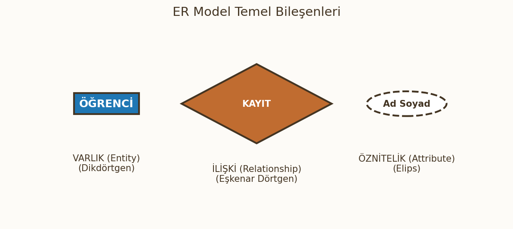
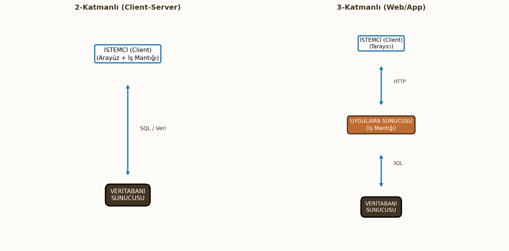

# Veritabanı Mimarisi ve Temel Kavramlar

Bu bölüm; veri modellerini, şemaları, veritabanı dillerini ve modern sistem mimarilerini kapsamaktadır.

---

## 1. Veri Modelleri, Şemalar ve Örnekler

### Veri Soyutlama (Data Abstraction)
Veri soyutlama, kullanıcıların ve uygulama programlarının verinin diskte fiziksel olarak nasıl saklandığı gibi karmaşık detaylardan (depolama yapısı, dosya formatları) korunmasıdır. VTYS, verinin sadece mantıksal görünümünü sunarak programcıların işini kolaylaştırır ve veri bağımsızlığını sağlar.

### Veri Modeli Tanımı ve Bileşenleri
**Veri Modeli**, verinin yapısını, kısıtlamalarını ve manipülasyon işlemlerini tanımlayan kavramsal araçlar bütünüdür.

### Veritabanı Yapısı (Structure)
Veri modelinin ilk bileşenidir ve verinin organizasyon kurallarını tanımlar (Örn: İlişkisel modelde tablolar, sütunlar, veri tipleri).

### Veri Üzerindeki İşlemler (Operations)
Veritabanı üzerinde veriyi sorgulama, ekleme, güncelleme ve silme (CRUD) işlemlerini ifade eden bir dizi temel işlem kümesidir.

### Veritabanının Dinamik Yönü (Behavior)
Veri modelinin bütünlük kısıtlamalarını ve doğrulama mekanizmalarını içerir. Veri tutarlılığını sağlamak için uygulanan kurallar bütünüdür (Örn: Anahtar kısıtları).

## Veri Modeli Kategorileri
Veri modelleri, sundukları soyutlama seviyesine göre üçe ayrılır:

### Yüksek Seviye / Kavramsal Veri Modelleri
İnsan algısına en yakın, kolay anlaşılır modellerdir. Uygulama alanının kavramsal yapısını fiziksel detaylardan bağımsız olarak tanımlar. **Varlık-İlişki (ER) Modeli** bu kategoriye en iyi örnektir.

### Temsili Veri Modelleri
Kullanıcılar ve VTYS arasında bir köprü görevi görür. Fiziksel detayları gizlerken, tablo veya kayıt tabanlı yapıları temsil eder. **İlişkisel Veri Modeli**, Ağ Modeli ve Hiyerarşik Modeller bu kategoridedir.

### Düşük Seviye / Fiziksel Veri Modelleri
Verinin diskte nasıl depolanacağı, erişim yolları, kayıt formatları ve indeksleme gibi fiziksel detayları içerir. VTYS çekirdeği tarafından kullanılır.

## ER Model Temelleri
Varlık-İlişki (Entity-Relationship) Modeli, kavramsal tasarım aşamasında kullanılır.

 

### Varlık (Entity)
Gerçek dünyadaki somut veya soyut, ayırt edilebilir nesnelerdir (Örn: Öğrenci, Ders, Kitap).

### Öznitelik (Attribute)
Varlıkları tanımlayan özelliklerdir (Örn: Öğrenci varlığının No, Ad, Soyad öznitelikleri). Öznitelikler basit, bileşik, tek değerli, çok değerli veya türetilmiş olabilir.

### İlişki (Relationship)
İki veya daha fazla varlık arasındaki mantıksal bağlantıdır (Örn: Öğrenci bir Derse *Kayıt Olması*). İlişkinin türü ve kardinalitesi (1:1, 1:N, N:M) önemlidir. ## Spesifik Veri Modelleri

### İlişkisel Veri Modeli (Relational Data Model)
Veriyi **ilişki** (Relation - Tablo) formatında, satırlar (Tuple) ve sütunlar (Attribute) halinde düzenler. Matematiksel küme teorisine dayanır.
$$r(R) \subseteq D_1 \ast D_2 \ast \dots \ast D_n$$

### Nesne Veri Modeli (Object Data Model)
Nesne Yönelimli Programlama (OOP) kavramlarını (kalıtım, polimorfizm) veritabanına taşır. Veri ve işlemler (metotlar) birlikte saklanır.

## Fiziksel Veri Modeli Kavramları

### Erişim Yolu (Access Path)
Veritabanı yöneticisinin, sorgulanan verilere disk üzerinde ulaşmak için kullandığı yöntemdir (Örn: İndeks kullanarak doğrudan erişim).

### İndeks (Index)
Belirli öznitelik(ler) üzerinde tanımlanan ve verilere hızlı erişim sağlayan ek veri yapısıdır. Hızlı arama için kritik öneme sahiptir.

## Şemalar ve Durumlar

### Veritabanı Şeması (Database Schema)
Veritabanının **tanımıdır**. Yapıyı (ilişkilerin adları, öznitelikleri, veri tipleri ve kısıtları) ifade eder. Şema tasarım aşamasında belirlenir ve nispeten statiktir.

### Şema Diyagramı (Schema Diagram)
Veritabanı şemasının görsel temsilidir. Tabloları, öznitelikleri ve aralarındaki ilişkileri (FK'ler) gösterir.

### Veritabanı Durumu / Anlık Görüntüsü (Database State / Snapshot)
Veritabanında **belirli bir anda** bulunan tüm verilerin (kayıtların) toplamıdır. Durum (örnek) dinamiktir ve sürekli değişir. Veritabanı her zaman bir **Geçerli Durumda** olmalıdır.

### Şema Evrimi (Schema Evolution)
Veritabanı şemasının ihtiyaçlara göre zaman içinde değiştirilmesi sürecidir (Örn: `ALTER TABLE` komutları ile yeni bir sütun eklenmesi).

---

# 2. Üç Şemalı Mimari ve Veri Bağımsızlığı

## Üç Şemalı Mimari Düzeyleri

### İçsel Seviye (Internal Level)
* **Amaç:** Verinin fiziksel depolama yapısını tanımlar.
* **İçerik:** Kayıtların disk üzerindeki yerleşimi, depolama yolu bilgisi ve indeksleme detayları.

### Kavramsal Seviye (Conceptual Level)
* **Amaç:** **Tüm veritabanının** mantıksal yapısını, ilişkilerini ve kısıtlamalarını tanımlar.
* **İçerik:** Hangi verilerin tutulduğu (varlıklar), aralarındaki ilişkiler. Fiziksel detayları gizler.

### Dışsal / Görünüm Seviyesi (External / View Level)
* **Amaç:** Son kullanıcıların ihtiyaç duyduğu **özel görünümleri** (Views) sunar.
* **İçerik:** Kullanıcının görmesine izin verilen, kısıtlı bir alt şema.

## Veri Bağımsızlığı (Data Independence)
!!! warning "Dikkat"
    Veri bağımsızlığı, bir seviyede yapılan değişikliğin üst seviyeleri etkilememesini sağlar. Bu, mimarinin ana hedefidir.

### Mantıksal Veri Bağımsızlığı (Logical Data Independence)
**Kavramsal şemada** (tablo ekleme, sütun ekleme/silme) yapılan bir değişikliğin, **Dışsal şemaları** (uygulamaları) etkilememesidir.

### Fiziksel Veri Bağımsızlığı (Physical Data Independence)
**İçsel şemada** (indeksleme, dosya organizasyonu) yapılan bir değişikliğin, **Kavramsal şemayı** ve dolayısıyla uygulamaları etkilememesidir.

# 3. VTYS Dilleri (DBMS Languages) ve Arayüzler

## Veri Tanımlama Dili (DDL)
DDL (Data Definition Language), veritabanının yapısını, yani şemasını oluşturmak, değiştirmek ve silmek için kullanılır. Komutlar VTYS tarafından işlenir ve sonuçları **Sistem Kataloğu**'na kaydedilir.
* Örnekler: `CREATE TABLE Personel (ID INT PRIMARY KEY, Ad VARCHAR(50));`, `ALTER TABLE Personel ADD Maas FLOAT;`.

## Depolama Tanımlama Dili (SDL)
SDL (Storage Definition Language), İçsel (Fiziksel) seviye şemasını tanımlar. Verilerin diskte fiziksel olarak tutulma detaylarını (indeksler, erişim yolları, kayıt formatları) belirler. Günümüzde genellikle DDL komutları (Örn: `CREATE INDEX`) ile bütünleştirilmiştir.

## Görünüm Tanımlama Dili (VDL)
VDL (View Definition Language), Dışsal (External) seviye şemalarını, yani kullanıcıların erişim sağladığı sanal tabloları (**Views**) oluşturmak için kullanılır. Mantıksal veri bağımsızlığını sağlamada kritik rol oynar.
* Örnek: `CREATE VIEW PersonelKursSayisi AS SELECT * FROM ...`

## Veri İşleme Dili (DML)
DML (Data Manipulation Language), veritabanında saklanan verilere erişim, ekleme, silme ve güncelleme işlemlerini gerçekleştirir (CRUD). DML, iki ana yaklaşımla çalışır:

1.  **Prosedürel DML:** Kullanıcının, veriye ulaşmak için izlenecek **adımları (yolu)** belirtmesini gerektirir.
2.  **Deklaratif DML (SQL):** Kullanıcının sadece **ne istediğini** belirtmesi yeterlidir, **nasıl** yapılacağına VTYS karar verir.

Örnekler: `SELECT * FROM tablo`, `INSERT INTO tablo VALUES (...)`.

## DBMS Arayüz Çeşitleri
VTYS, farklı kullanıcı tiplerine yönelik çeşitli arayüzler sunar:

* **Sıradan Kullanıcı Arayüzleri:** Menü tabanlı, form tabanlı ve GUI'ler (Navicat, DBeaver).
* **Programatik Arayüzler:** Taşıyıcı diller (Java, C++) içinde SQL komutlarının çağrılmasını sağlayan API'ler (ODBC/JDBC).

---

# 4. Veritabanı Sistemi Ortamı ve Bileşenleri

## Kullanıcı Kategorileri
Veritabanı sistemini kullanan veya yöneten temel roller şunlardır:

### Veritabanı Yöneticisi (DBA Staff)
Veritabanının yetkili ve merkezi yönetiminden sorumlu profesyonel personeldir. Şema tanımı, güvenlik, yetkilendirme, yedekleme ve kurtarma işlemlerini yönetir.

### Sıradan Kullanıcılar (Casual Users)
Veritabanına nadiren, farklı bilgilere ihtiyaç duyarak erişen ve genellikle geçici (ad-hoc) SQL sorguları yazan kullanıcılardır.

### Uygulama Programcıları (Application Programmers)
Önceden tanımlanmış iş mantığını içeren uygulama programlarını (Front-end/Back-end) geliştiren profesyonellerdir. Programları, DML komutlarını içerir.

### Parametrik Kullanıcılar (Parametric Users)
Veritabanına çok sık erişen, ancak sadece önceden tanımlanmış işlemleri (menüler, formlar) kullanan, profesyonel olmayan kullanıcılardır (Örn: Banka vezne görevlisi).

## DBMS Bileşen Modülleri
DBMS, kullanıcı taleplerini işlemek ve veriyi güvenilir şekilde yönetmek için bir dizi entegre modülden oluşur. 

### DDL Derleyicisi (DDL Compiler)
DDL komutlarını işler ve sonuçta ortaya çıkan şema tanımını (meta-veri) **Sistem Kataloğu**'na kaydeder.

### Sorgu Derleyicisi (Query Compiler)
SQL sorgusunu sözdizimsel ve anlamsal olarak analiz eder, geçerliliğini kontrol eder ve iç gösterime (Internal Representation) çevirir.

### Sorgu Optimizasyonu (Query Optimizer)
Sorguyu çalıştırmak için maliyeti en düşük (en hızlı) olan **yürütme planını (execution plan)** seçen kritik bir bileşendir. Erişim yollarını ve indeks kullanımını değerlendirir.

### Çalışma Zamanı Veritabanı İşlemcisi (Runtime Database Processor)
Optimizasyonun oluşturduğu planı uygulayan ve disk üzerindeki veriye erişimi sağlayan ana yürütme motorudur.

### Eşzamanlılık Kontrolü / Yedekleme / Kurtarma Alt Sistemleri (Transaction Manager)
Veritabanının güvenilirliğini (ACID) ve çok kullanıcılı ortamda veri tutarlılığını (Concurrency Control) sağlamaktan sorumludur.

## Sistem Kataloğu (Data Dictionary)
Sistem Kataloğu, Veritabanı hakkındaki tüm meta-verileri (şema, kısıtlar, yetkiler, indeksler) saklayan bir veritabanı içinde veritabanıdır. Diğer tüm bileşenler tarafından kullanılır ve güncellenir.

# 5. VTYS Mimarileri ve Sınıflandırma

## Merkezi (Centralized) Mimari
Merkezi mimaride, tüm VTYS bileşenleri, veri, CPU'lar ve depolama tek bir ana bilgisayar (Sunucu) üzerinde bulunur. İşlemlerin tümü bu tek merkezde yapılır. Kullanıcı terminalleri (eski yapılarda sadece giriş/çıkış cihazları) bu ana bilgisayara bağlanır. Bu yapı günümüzde genellikle tek kullanıcılı uygulamalar veya eski ana bilgisayar sistemleri için kullanılır.

## İstemci/Sunucu (Client/Server) Mimarileri
İstemci/Sunucu mimarisi, iş yükünü, istemci (son kullanıcı cihazı) ve sunucu (veritabanı motoru) arasında dağıtır. Bu, performansı ve ölçeklenebilirliği artırır. 

### Sunucu Türleri (File, Print, Web, E-mail, Database Servers)
Bir ağ üzerinde birçok farklı sunucu türü görev yapabilir.

* **Veritabanı Sunucusu (Database Server):** Veri işleme, sorgu yürütme ve eşzamanlılık kontrolü gibi tüm VTYS fonksiyonlarını üstlenir.
* **Diğer Sunucular:** Dosya, Baskı, Web ve E-posta gibi farklı servisleri sağlarlar.

### İstemci Makine Özellikleri
İstemciler, yükün nerede işlendiğine göre kalın (Thick) veya ince (Thin) olarak sınıflandırılır:

* **Kalın İstemci (Thick Client):** Uygulama mantığının büyük bir kısmını ve kullanıcı arayüzünü (GUI) kendi üzerinde barındırır. (Örn: İki Katmanlı mimarinin geleneksel istemcileri).
* **İnce İstemci (Thin Client):** Sadece sunum (arayüz) görevini üstlenir. İş mantığını ve veri işleme görevlerini Uygulama Sunucusuna veya Veritabanı Sunucusuna devreder. (Örn: Web tarayıcıları).

## İki Katmanlı (Two-Tier) Mimari
İki Katmanlı mimari, İstemci (Kullanıcı arayüzü ve iş mantığı) ve Veritabanı Sunucusu olmak üzere iki katmandan oluşur.

* İstemci, **ODBC** (Open Database Connectivity) veya **JDBC** (Java Database Connectivity) gibi standart arayüzler kullanarak doğrudan Veritabanı Sunucusuyla iletişim kurar.
* Bu yapı, büyük kullanıcı sayılarında ve karmaşık iş mantığında ölçeklenebilirlik ve güvenlik sorunları yaratabilir. 

## Üç ve n-Katmanlı (Three-Tier / n-Tier) Mimari
Üç Katmanlı mimaride, İstemci ve Veritabanı Sunucusu arasına üçüncü bir katman eklenir.

1.  **Sunum Katmanı (Presentation Tier):** İstemci (GUI).
2.  **Uygulama/İş Mantığı Katmanı (Application/Business Logic Tier):** Uygulama Sunucusu.
3.  **Veri Katmanı (Data Tier):** Veritabanı Sunucusu.

### Uygulama Sunucusu (Application Server / Web Server) Rolü
Uygulama Sunucusu, iş mantığını ve kurallarını merkezileştirir.

* **Güvenlik:** Doğrudan veritabanı erişimini engelleyerek güvenliği artırır.
* **Ölçeklenebilirlik:** İş yükünü dengeleyerek çok sayıda istemciyi destekleyebilir.
* **Yönetilebilirlik:** İş mantığındaki güncellemelerin sadece bu katmanda yapılmasını sağlar. 

## VTYS Sınıflandırma Kriterleri
VTYS'ler, çeşitli özelliklerine göre sınıflandırılır:

### Veri Modeli
Destekledikleri temel veri yapısına göre sınıflandırılırlar:

* **İlişkisel (RDBMS):** Tablo tabanlı.
* **Nesneye Yönelik (OODBMS):** Nesne tabanlı.
* **Hiyerarşik, Ağ, NoSQL (Belge, Grafik, Anahtar-Değer) vb.**

### Kullanıcı Sayısı
* **Tek Kullanıcılı (Single-User):** Aynı anda sadece bir kullanıcının erişimine izin verir.
* **Çok Kullanıcılı (Multi-User):** Aynı anda birden fazla kullanıcının erişimine izin verir. Eşzamanlılık kontrol mekanizmalarına ihtiyaç duyar.

### Sistem Sayısı (Merkezi vs Dağıtık - Distributed)
* **Merkezi (Centralized):** Tüm veri ve VTYS tek bir yerde bulunur.
* **Dağıtık (Distributed):** Veri, birden fazla ağ bağlantılı bilgisayara (node) dağıtılmıştır. Dağıtık sistemler **Homojen** (aynı VTYS yazılımı) veya **Heterojen** (farklı VTYS yazılımları) olabilir.

### Lisans Maliyeti
* **Ticari (Proprietary):** Lisans ücreti gerektiren sistemler (Örn: Oracle, SQL Server).
* **Açık Kaynak (Open Source):** Ücretsiz kullanılabilen sistemler (Örn: PostgreSQL, MySQL).