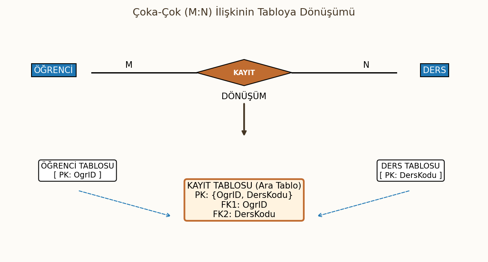
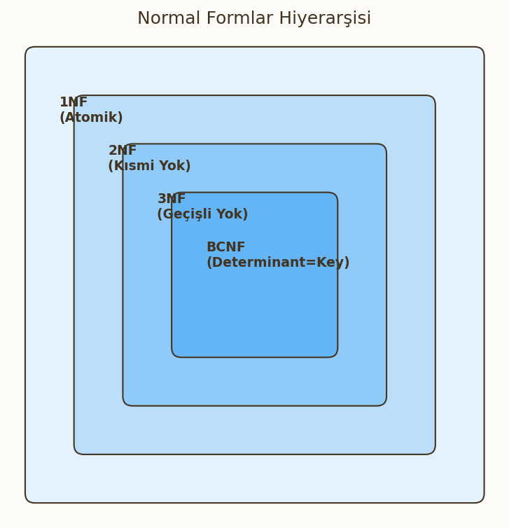

# ER Modelden Tabloya Dönüşüm ve Normalizasyon

Bu bölüm, veritabanı tasarımının **mantıksal tasarım** aşamasını kapsamaktadır. Kavramsal olarak tasarlanan ER diyagramlarının ilişkisel tablolara dönüştürülmesi (Mapping) kuralları ve veri tabanı performansını, bütünlüğünü ve tutarlılığını sağlamak için uygulanan **Normalizasyon** süreçleri (1NF, 2NF, 3NF, BCNF) detaylı analiz örnekleriyle ele alınmıştır.

---

## 1. ER Diyagramlarının Tabloya Dönüştürülmesi

Kavramsal tasarım aşamasının çıktısı olan ER Diyagramları, mantıksal tasarım aşamasında İlişkisel Modelin temel yapı taşı olan tablolara dönüştürülür. Bu dönüşümde anahtarların (PK ve FK) doğru yerleştirilmesi kritiktir.

### Bire Bir (1:1) İlişkilerin Dönüştürülmesi
Bir varlık kümesindeki her kaydın, diğer varlık kümesindeki en fazla bir kayıtla ilişkilendirildiği durumdur.

!!! note "Dönüşüm Kuralı (1:1)"
    Dönüşüm için iki geçerli yol vardır:

    1. İki tablo ayrı tutulur ve **birinci tablonun PK'sı, ikinci tabloya FK olarak eklenir.**
    2. En az NULL değer içerecek taraf seçilir ve o tabloya diğer tablonun PK'sı FK olarak eklenir. (NULL içermeyecek tabloya eklemek tercih edilir).
    3. Alternatif olarak, iki tablo tek bir tabloda birleştirilebilir.

* **Örnek:** `Personel` (1:1) `OtoparkYeri`. `Personel` tablosunun PK'sı (`PersonelID`), `OtoparkYeri` tablosuna FK olarak eklenir ve bu FK aynı zamanda PK veya Unique kısıtlı olarak tanımlanır. 

### Birden Çoğa (1:N) İlişkilerin Dönüştürülmesi
Bu, ilişkisel veritabanı tasarımında en sık karşılaşılan kuraldır.

!!! warning "Dönüşüm Kuralı (1:N)"
    İlişkiye katılan **N tarafındaki** (çoklu taraf) tabloya, **1 tarafındaki** (tekil taraf) tablonun Birincil Anahtarı (PK), Yabancı Anahtar (FK) olarak eklenir.

* **Örnek:** `Bölüm` (1:N) `Çalışan`. `Bölüm` tablosunun PK'sı (`BölümID`), `Çalışan` tablosuna FK olarak eklenir. Bu FK, `Çalışan` tablosunun PK'sının parçası değildir.

### Çoka Çok (M:N) İlişkilerin Dönüştürülmesi
M:N ilişkileri, doğrudan tablolar arasına FK eklenerek temsil edilemez.

!!! warning "Dönüşüm Kuralı (M:N)"
    Çoka çok ilişkileri çözmek için **üçüncü bir ara tablo (Junction Table)** oluşturulur.

    1.  Ara tablonun içine, ilişkiye katılan her iki tablonun PK'ları FK olarak eklenir.
    2.  Ara tablonun **Birincil Anahtarı (PK)**, bu iki FK'nın **birleşimiyle (Composite Key)** oluşur.
* **Örnek:** `Öğrenci` (M:N) `Ders`. Ara tablo `Kayıt` oluşur. PK'sı: $\\{\text{OgrenciID}, \text{DersKodu}\\}$.

### Çok Değerli Özniteliklerin Dönüştürülmesi
Bir varlığın aynı öznitelik için birden fazla değere sahip olabildiği durumlardır (Örn: `Personel`in `Telefon Numaraları`).

!!! note "Dönüşüm Kuralı (Çok Değerli)"
    Çok değerli öznitelikler **ayrı bir tabloya** dönüştürülür.

    1.  Yeni tabloda, çok değerli özniteliğin kendisi (Örn: `TelefonNo`) bir sütun olur.
    2.  Bu yeni tabloya, ait olduğu varlık kümesinin PK'sı (Örn: `PersonelID`) FK olarak eklenir.
    3.  Yeni tablonun PK'sı, **FK ile çok değerli özniteliğin birleşimiyle** oluşur.
* **Örnek Tablo:** `PersonelTelefonlari` $\{\text{PersonelID (FK, PK parçası)}, \text{TelefonNo (PK parçası)}\}$.

---

## 2. Normalizasyon Giriş

Normalizasyon, veri tekrarını (redundancy) azaltmak ve veri bütünlüğünü artırmak için tabloları sistematik bir şekilde ayrıştırma sürecidir.

### Normalizasyonun Amaçları
* **Veri Bütünlüğü (Integrity):** Güncelleme, ekleme ve silme anomalilerini (anomalies) ortadan kaldırmak.
* **Bağımsızlık:** Veritabanını uygulamalardan daha bağımsız hale getirmek.
* **Performans:** Veri tekrarını azaltarak depolama alanından tasarruf etmek ve veri erişim hızını artırmak (Teorik olarak, pratikte bazen denormalizasyon gerekebilir).

### Normalizasyon Aşamaları (Genel Bakış)
Normalizasyon, bir dizi kural (Normal Form) üzerinden ilerler. Bir tablo, bir sonraki seviyeye geçmek için önceki seviyenin tüm kurallarını sağlamalıdır.

$$1NF \subset 2NF \subset 3NF \subset BCNF$$

---

## 3. Bağımlılık Türleri (Dependency Types)

Normalizasyonun temelini, tablolar içindeki öznitelikler arasındaki bağımlılık ilişkileri oluşturur.

### Fonksiyonel Bağımlılık (Functional Dependency - FD) -> $X \rightarrow Y$ gösterimiyle.
Bir $R$ tablosundaki öznitelik kümesi $X$, $Y$ öznitelik kümesini fonksiyonel olarak belirlerse ($X \rightarrow Y$), bu şu demektir:

* $R$'nin herhangi iki kaydında, eğer $X$ değerleri eşitse, $Y$ değerleri de mutlaka eşit olmalıdır.
* $X$ değeri, $Y$ değerini benzersiz olarak belirler.

### Tam Fonksiyonel Bağımlılık (Full Functional Dependency)
Bir öznitelik kümesi $X$, bir $Y$ özniteliğini fonksiyonel olarak belirliyorsa ($X \rightarrow Y$), ve $X$'in hiçbir **öz alt kümesi** ($X'$), $Y$'yi tek başına belirleyemiyorsa, bu bağımlılık tam fonksiyonel bağımlılıktır.

### Kısmi Bağımlılık (Partial Dependency)
Bir tabloda, **birincil anahtarın sadece bir parçası** (öz alt kümesi) tablonun birincil anahtar olmayan özniteliklerinden birini belirliyorsa, bu kısmi bağımlılıktır.

* $\\{A, B\\} \rightarrow C$ iken, $A \rightarrow C$ şartı sağlanıyorsa, $\\{A, B\\} \rightarrow C$ kısmi bağımlılıktır. (1NF'yi çözerken görülür).

### Geçişli Bağımlılık (Transitive Dependency)
Bir tabloda, birincil anahtar olmayan bir $Z$ özniteliği, yine birincil anahtar olmayan başka bir $Y$ özniteliğini belirliyorsa, bu geçişli bağımlılıktır.

* $X \rightarrow Y$ ve $Y \rightarrow Z$ iken, $X \rightarrow Z$ ilişkisi oluşur. (3NF'yi çözerken kritiktir).

### Çok Değerli Bağımlılık (Multivalued Dependency)
Çok değerli bağımlılık ($X \rightarrow \rightarrow Y$), bir $X$ değeri için, $Y$ değerlerinin bir kümesinin var olduğunu belirtir ve bu küme, tablodaki diğer özniteliklerden bağımsızdır. Çok değerli bağımlılıklar 4NF'nin temelidir.

---

## 4. Normal Formlar

Normalizasyon süreci, tabloları belirli kurallar (Normal Formlar) setine uygun hale getirerek veri tekrarını ve anomalileri ortadan kaldırmayı amaçlar. 

### Normal Olmayan Form (Unnormalized Form - UNF)
Bu, verilerin ham, işlenmemiş halidir. Bir tabloda hücre başına birden fazla değer veya **tekrarlayan gruplar (Repeating Groups)** bulunur. İlişkisel veritabanı teorisine göre bu yapıya izin verilmez.

* **Sorun:** İlişkisel modelin temel yapısını bozar.

### Birinci Normal Form (1NF)

#### Kural: Atomik Değerler, Tekrarlayan Grup Yok.
Bir tablo 1NF'de olmak için şu iki kurala uymalıdır:

1.  Her hücrede (satır/sütun kesişiminde) **atomik (bölünemez)** tek bir değer bulunmalıdır.
2.  Tabloda **tekrarlayan gruplar** olmamalıdır.
* **Çözüm:** Tekrarlayan gruplar kaldırılır, her tekrar ayrı bir satır olarak listelenir ve yeni bir Primary Key (PK) tanımlanır.

#### 1 NF Sorunları (Anomalies)
Birincil anahtara tam olarak bağlı olmayan öznitelikler nedeniyle tabloda anomaliler (veri tutarsızlığı sorunları) yaşanır:

* **Ekleme (Insertion) Anomalisi:** Yeni bir bilgi eklemek için, henüz var olmayan başka bir bilgiyi de girmek zorunda kalmak.
* **Silme (Deletion) Anomalisi:** Bir kaydı silerken, silmek istemediğimiz başka bir bilgiyi de kaybetmek.
* **Güncelleme (Update) Anomalisi:** Aynı bilginin birden fazla yerde tutulması nedeniyle, güncellenmesi gerektiğinde tüm kopyaların güncellenmemesi sonucu veri tutarsızlığı oluşması.

### İkinci Normal Form (2NF)

#### Kural: 1NF + Kısmi Bağımlılık Yok
Bir tablo 2NF'de olmak için:

1.  1NF'de olmalıdır.
2.  Tabloda **kısmi fonksiyonel bağımlılık (Partial Functional Dependency)** olmamalıdır. Yani, **birincil anahtar olmayan hiçbir öznitelik**, birleşik anahtarın (Composite Key) **sadece bir parçasına** fonksiyonel olarak bağımlı olmamalıdır.

* **Sorun Nedir?** Kısmi bağımlılıklar veri tekrarına yol açar (Örn: Birleşik anahtarın bir parçası, birincil anahtar olmayan bir sütunu tekrar tekrar belirler).
* **Çözüm Nedir?** Kısmi bağımlılığa neden olan öznitelikler, anahtarın bağımlı oldukları parçasıyla birlikte **ayrı bir tabloya** taşınır.

#### 2NF Sorunları: Hâlâ Geçişli Bağımlılıklar Var.
2NF, kısmi bağımlılıkları çözer, ancak birincil anahtar olmayan öznitelikler arasındaki bağımlılıkları (**Geçişli Bağımlılık**) çözmez. Bu durum, 3NF'ye geçişi gerektirir.

### Üçüncü Normal Form (3NF)

#### Kural: 2NF + Geçişli Bağımlılık Yok
Bir tablo 3NF'de olmak için:

1.  2NF'de olmalıdır.
2.  Tabloda **geçişli fonksiyonel bağımlılık (Transitive Dependency)** olmamalıdır. Yani, birincil anahtar olmayan alanlar birbirine bağlı olamaz.

* **Sorun Nedir?** Geçişli bağımlılık (Örn: $\text{PK} \rightarrow \text{A}$ ve $\text{A} \rightarrow \text{B}$) Veri Tekrarına ve Güncelleme anomalilerine yol açar.
* **Çözüm Nedir?** Geçişli bağımlılığa neden olan öznitelik (Örn: A ve B), belirleyen (A) ile birlikte **ayrı bir tabloya** taşınır.

### Boyce-Codd Normal Formu (BCNF)
BCNF, 3NF'nin daha sıkı bir tanımıdır ve tüm anomalileri çözer (4NF ve 5NF hariç).

#### Kural: Her Determinant Bir Aday Anahtar Olmalı
Bir tablo BCNF'de olmak için, tabloda tanımlanan her fonksiyonel bağımlılık ($X \rightarrow Y$) için, **belirleyen ($X$)** mutlaka bir **aday anahtar (Candidate Key)** olmalıdır.

* **Farkı:** BCNF, birden fazla aday anahtarın olduğu ve bir aday anahtarın birincil anahtar olmayan başka bir özniteliğe bağlı olduğu özel durumlarda 3NF'nin çözemediği anomalileri çözer. Her BCNF tablo 3NF'dir, ancak her 3NF tablo BCNF olmayabilir.

### Dördüncü Normal Form (4NF)

#### Kural: BCNF + Çok Değerli Bağımlılık Yok
Bir tablo 4NF'de olmak için:

1.  BCNF'de olmalıdır.
2.  Tabloda **çok değerli bağımlılık (Multivalued Dependency - MVD)** olmamalıdır.

 **Sorun Nedir?** Çok değerli bağımlılık ($X \rightarrow \rightarrow Y$) veri tekrarına yol açar. Bu durum, genellikle çok değerli özniteliklerin 1NF'de çözülmesinden sonra ortaya çıkar.

 **Çözüm Nedir?** Çok değerli bağımlılığa neden olan öznitelikler **ayrı bir tabloya** taşınır ve sadece Primary Key ile çok değerli özniteliği içerir.

---

## 5. Normalizasyon Uygulama Örnekleri

Bu bölümde, karmaşık veri yapılarını analiz ederek, veri tekrarını ve anomali risklerini ortadan kaldırmak için tabloları adım adım Birinci (1NF), İkinci (2NF) ve Üçüncü (3NF) Normal Formlara ayıracağız.

### Örnek 1: Okul Tablosu Çözümlemesi

**Senaryo:** Okul sistemi, öğrencilerin kişisel bilgilerini, kayıtlı olduğu bölümü ve aldığı dersleri/notları tek bir tabloda tutmaktadır.

#### Başlangıç: Normal Olmayan Form (UNF)

`OGRENCI_DETAY` tablosunda, bir öğrenci birden fazla ders alabileceği için `(DersKodu, Not)` tekrarlayan bir gruptur.

| OgrID (PK) | OgrAd | BolumAd | BolumBaskanı | Dersler (Tekrarlayan Grup) |
| :---: | :--- | :--- | :--- | :---: |
| 100 | Ali | Bilgisayar Müh. | Ayşe Yılmaz | {DVT(A), YZ(B)} |
| 101 | Veli | İnşaat Müh. | Can Kaya | {STA(A+)} |

#### Adım 1: Birinci Normal Form (1NF)

Tekrarlayan grubu kaldırıp atomikleştirme. PK: $\\{\text{OgrID}, \text{DersKodu}\\}$.

| **OgrID** (PK parçası) | OgrAd | **DersKodu** (PK parçası) | Not | BolumAd | BolumBaskanı |
| :---: | :--- | :---: | :---: | :--- | :--- |
| 100 | Ali | DVT | A | Bilgisayar Müh. | Ayşe Yılmaz |
| 100 | Ali | YZ | B | Bilgisayar Müh. | Ayşe Yılmaz |
| 101 | Veli | STA | A+ | İnşaat Müh. | Can Kaya |

!!! warning "1NF Sorunları"
    `OgrAd`, `BolumAd`, `BolumBaskanı` bilgileri tekrar etmektedir. Bu, **Kısmi Bağımlılığa** ve **Geçişli Bağımlılığa** işaret eder.

#### Adım 2: İkinci Normal Form (2NF)

Kısmi Bağımlılığı çözme: Birincil anahtarın sadece bir parçasına ($\text{OgrID}$) bağlı olan öznitelikler (`OgrAd`, `BolumAd`, `BolumBaskanı`) ayrılır.

**Tablo 1: OGRENCI**

* **PK:** $\\{\text{OgrID}\\}$
* **Bağımlılık:** $\text{OgrID} \rightarrow \text{OgrAd}, \text{BolumAd}, \text{BolumBaskanı}$ (Hâlâ geçişli bağımlılık içerir.)

| **OgrID** | OgrAd | BolumAd | BolumBaskanı |
| :---: | :--- | :--- | :--- |
| 100 | Ali | Bilgisayar Müh. | Ayşe Yılmaz |
| 101 | Veli | İnşaat Müh. | Can Kaya |

**Tablo 2: KAYIT**

* **PK:** $\\{\text{OgrID, DersKodu}\\}$
* **Bağımlılık:** $\\{\text{OgrID}, \text{DersKodu}\\} \rightarrow \text{Not}$ (Tam Bağımlılık)

| **OgrID (FK)** | **DersKodu** | Not |
| :---: | :---: | :---: |
| 100 | DVT | A |
| 100 | YZ | B |
| 101 | STA | A+ |

#### Adım 3: Üçüncü Normal Form (3NF)

Geçişli Bağımlılığı çözme: $\text{OgrID} \rightarrow \text{BolumAd}$ ve $\text{BolumAd} \rightarrow \text{BolumBaskanı}$ ilişkisini parçala.

**Tablo 3: BOLUM**

* **PK:** $\\{\text{BolumAd}\\}$
* **Bağımlılık:** $\text{BolumAd} \rightarrow \text{BolumBaskanı}$

| **BolumAd** | BolumBaskanı |
| :---: | :--- |
| Bilgisayar Müh. | Ayşe Yılmaz |
| İnşaat Müh. | Can Kaya |

**Nihai Tablolar (3NF):**

1.  **OGRENCI** $\\{\text{OgrID (PK)}, \text{OgrAd}, \text{BolumAd (FK)}\\}$
2.  **KAYIT** $\\{\text{OgrID (FK, PK parçası)}, \text{DersKodu (PK parçası)}, \text{Not}\\}$
3.  **BOLUM** $\\{\text{BolumAd (PK)}, \text{BolumBaskanı}\\}$

---

### Örnek 2: Bilgisayar Kasası/Ürün Parça Çözümlemesi

**Senaryo:** Bir firma, ürettiği bilgisayar kasalarını ve bu kasaları oluşturan parçaları (ParçaNo, ParçaAdı) ve bu parçaları hangi tedarikçinin sağladığını (TedarikçiNo, TedarikçiAdı) kaydetmektedir.

#### Başlangıç: Normal Olmayan Form (UNF)

* Bir `KasaID` birden fazla `ParçaNo` içerir (Tekrarlayan Grup).
* Her `ParçaNo` birden fazla `TedarikçiNo` ile tedarik edilebilir (Tekrarlayan Grup).

#### Adım 1: Birinci Normal Form (1NF)

PK: $\\{\text{KasaID, ParçaNo, TedarikçiNo}\\}$

| **KasaID** (P) | **ParçaNo** (P) | **TedarikçiNo** (P) | KasaAdı | ParçaAdı | TedarikçiAdı | Fiyat |
| :---: | :---: | :---: | :--- | :--- | :--- | :---: |
| K1 | P1 | T1 | Oyuncu Kasa | Ram 16GB | A Ltd. | 1000 |
| K1 | P2 | T2 | Oyuncu Kasa | Anakart | B AŞ. | 3000 |
| K2 | P1 | T1 | Ofis Kasa | Ram 16GB | A Ltd. | 1100 |

#### Adım 2: İkinci Normal Form (2NF)

Kısmi Bağımlılıkları çözme:

1.  $\text{KasaID} \rightarrow \text{KasaAdı}$ (Kısmi Bağımlılık)
2.  $\text{ParçaNo} \rightarrow \text{ParçaAdı}$ (Kısmi Bağımlılık)
3.  $\text{TedarikçiNo} \rightarrow \text{TedarikçiAdı}$ (Kısmi Bağımlılık)

**Tablo 1: KASA** $\\{\text{KasaID (PK)}, \text{KasaAdı}\\}$

**Tablo 2: PARCA** $\\{\text{ParçaNo (PK)}, \text{ParçaAdı}\\}$

**Tablo 3: TEDARIKCI** $\\{\text{TedarikçiNo (PK)}, \text{TedarikçiAdı}\\}$

**Tablo 4: KASA\_ICERIK** $\\{\text{KasaID (FK, P)}, \text{ParçaNo (FK, P)}, \text{TedarikçiNo (FK, P)}, \text{Fiyat}\\}$

* `KASA_ICERIK` tablosu 2NF'dedir (PK'nın tamamına bağlıdır), ancak Tedarikçi bilgileri arasında geçişli bağımlılık riski hala vardır. Bu tablo aslında Üçlü (Ternary) ilişkiyi temsil eder.

#### Adım 3: Üçüncü Normal Form (3NF)

Örnek tablolarımızda **geçişli bağımlılık** yoktur (Çünkü $\text{ParçaNo}$'dan bağımsız bir $\text{X} \rightarrow \text{Y}$ ilişkisi kalmamıştır). Bu nedenle tüm tablolar **3NF**'dedir.

---

### Örnek 3: Sipariş Sistemi Çözümlemesi

**Senaryo:** Müşteri siparişlerini kaydeden bir tablo.

| SiparişNo (P) | MüşteriID | MüşteriAd | MüşteriAdres | ÜrünNo (P) | ÜrünAd | Adet | Fiyat |
| :---: | :--- | :--- | :--- | :---: | :--- | :---: | :---: |
| S1 | M10 | Ahmet Yılmaz | Ankara | U1 | Klavye | 2 | 200 |
| S1 | M10 | Ahmet Yılmaz | Ankara | U2 | Mouse | 1 | 150 |
| S2 | M20 | Ayşe Can | İzmir | U1 | Klavye | 3 | 200 |

#### Adım 1: Birinci Normal Form (1NF)

Tablo zaten 1NF'dedir (tekrarlayan grup yoktur, tüm değerler atomiktir). PK: $\\{\text{SiparişNo}, \text{ÜrünNo}\\}$

#### Adım 2: İkinci Normal Form (2NF)

Kısmi Bağımlılıkları çözme:

1.  $\text{SiparişNo} \rightarrow \text{MüşteriID}, \text{MüşteriAd}, \text{MüşteriAdres}$
2.  $\text{ÜrünNo} \rightarrow \text{ÜrünAd}$

**Tablo 1: SIPARIS\_BILGI**

* **PK:** $\\{\text{SiparişNo}\\}$
* **İçerik:** Siparişe ait tekil bilgiler (Müşteri detayları).

| **SiparişNo** | MüşteriID | MüşteriAd | MüşteriAdres |
| :---: | :--- | :--- | :--- |
| S1 | M10 | Ahmet Yılmaz | Ankara |
| S2 | M20 | Ayşe Can | İzmir |

**Tablo 2: URUN\_BILGI**

* **PK:** $\\{\text{ÜrünNo}\\}$
* **İçerik:** Ürüne ait tekil bilgiler.

| **ÜrünNo** | ÜrünAd |
| :---: | :--- |
| U1 | Klavye |
| U2 | Mouse |

**Tablo 3: SIPARIS\_DETAY**

* **PK:** $\\{\text{SiparişNo (FK, P)}, \text{ÜrünNo (FK, P)}\\}$
* **İçerik:** Sipariş hattı bilgileri (Miktar, Fiyat).

| **SiparişNo (FK)** | **ÜrünNo (FK)** | Adet | Fiyat |
| :---: | :---: | :---: | :---: |
| S1 | U1 | 2 | 200 |
| S1 | U2 | 1 | 150 |
| S2 | U1 | 3 | 200 |

#### Adım 3: Üçüncü Normal Form (3NF)

Geçişli Bağımlılıkları çözme:

`SIPARIS_BILGI` tablosunda geçişli bağımlılık vardır: $\text{SiparişNo} \rightarrow \text{MüşteriID}$ ve $\text{MüşteriID} \rightarrow \text{MüşteriAd}, \text{MüşteriAdres}$.

**Tablo 4: MUSTERI**

* **PK:** $\\{\text{MüşteriID}\\}$
* **İçerik:** Müşteriye ait kalıcı bilgiler.

| **MüşteriID** | MüşteriAd | MüşteriAdres |
| :---: | :--- | :--- |
| M10 | Ahmet Yılmaz | Ankara |
| M20 | Ayşe Can | İzmir |

**Nihai Tablolar (3NF):**

1.  **SIPARIS** $\\{\text{SiparişNo (PK)}, \text{MüşteriID (FK)}\\}$
2.  **MUSTERI** $\\{\text{MüşteriID (PK)}, \text{MüşteriAd}, \text{MüşteriAdres}\\}$
3.  **URUN** $\\{\text{ÜrünNo (PK)}, \text{ÜrünAd}\\}$
4.  **SIPARIS\_DETAY** $\\{\text{SiparişNo (FK, P)}, \text{ÜrünNo (FK, P)}, \text{Adet}, \text{Fiyat}\\}$