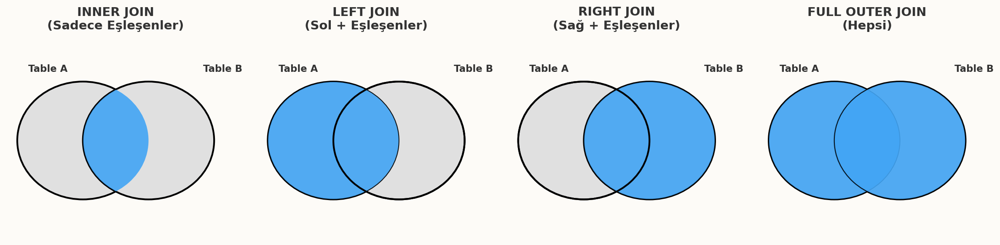

# SQL Uygulamaları ve Veri Manipülasyonu

Bu bölüm; veritabanı nesnelerinin oluşturulması (DDL), tablolar arası ilişkilerin kurulması, veri tipleri ve dönüşümleri ile verilerin sorgulanması, filtrelenmesi ve birleştirilmesi (JOIN) işlemlerini kapsamlı SQL örnekleriyle ele almaktadır.

## 1. Temel Veri Tanımlama ve İşleme

Veri Tanımlama Dili (DDL), veritabanı şemasını oluşturmak ve yönetmek için kullanılır. Bu komutlar veritabanı yapısını belirler.

### SQL - DDL (Veri Tanımlama Komutları)

#### Veritabanı ve Tablo Komutları (CREATE, DROP, ALTER TABLE)

Bir veritabanı projesine başlarken ilk adım veritabanını ve tabloları oluşturmaktır.

**Veritabanı Oluşturma ve Silme:**

**Örnek:** Yeni bir veritabanı oluşturur

    CREATE DATABASE SirketDB;

**Örnek:** Veritabanını siler (Dikkat: Tüm veriler kaybolur!)

    DROP DATABASE SirketDB;

**Örnek:** Çalışılacak veritabanını seçer

    USE SirketDB;

**Tablo Oluşturma ve Düzenleme:**

**Örnek:** Yeni bir tablo oluşturur

    CREATE TABLE Personel (
        PersonelID INT AUTO_INCREMENT PRIMARY KEY,
        Ad VARCHAR(50),
        Soyad VARCHAR(50),
        IseGirisTarihi DATE
    );

**Örnek :** Tabloya yeni bir sütun ekler (ALTER)

    ALTER TABLE Personel ADD Email VARCHAR(100);

**Örnek:** Tablodan bir sütunu siler

    ALTER TABLE Personel DROP COLUMN IseGirisTarihi;

**Örnek:** Tabloyu tamamen siler

    DROP TABLE Personel;

#### MySQL Constraints (Kısıtlayıcılar)

Veri bütünlüğünü sağlamak ve hatalı veri girişini engellemek için sütunlara kısıtlamalar getirilir.

**1. NOT NULL:** Sütunun boş bırakılamayacağını belirtir.

    CREATE TABLE Uyeler (
        UyeID INT,
        Ad VARCHAR(50) NOT NULL -- Ad mutlaka girilmelidir
    );

**2. UNIQUE:** Sütundaki tüm değerlerin benzersiz olmasını sağlar.

    CREATE TABLE Uyeler (
        UyeID INT,
        Email VARCHAR(100) UNIQUE -- Aynı e-posta ile ikinci kayıt yapılamaz
    );

**3. PRIMARY KEY:** Satırı benzersiz tanımlayan anahtardır (NOT NULL + UNIQUE).

    CREATE TABLE Uyeler (
        UyeID INT PRIMARY KEY, -- Birincil Anahtar
        Ad VARCHAR(50)
    );

**4. FOREIGN KEY:** Başka bir tablodaki birincil anahtarı referans alır.

    CREATE TABLE Siparisler (
        SiparisID INT PRIMARY KEY,
        UyeID INT,
        FOREIGN KEY (UyeID) REFERENCES Uyeler(UyeID) -- İlişkisel bütünlük
    );

**5. CHECK:** Verinin belirli bir koşulu sağlamasını zorunlu kılar.

    CREATE TABLE Urunler (
        UrunID INT PRIMARY KEY,
        Fiyat DECIMAL(10,2),
        CHECK (Fiyat > 0) -- Fiyat 0 veya negatif olamaz
    );

**6. DEFAULT:** Veri girilmezse varsayılan bir değer atar.

    CREATE TABLE Siparisler (
        SiparisID INT PRIMARY KEY,
        SiparisTarihi DATETIME DEFAULT CURRENT_TIMESTAMP -- Otomatik tarih atar
    );

---

## 2. Tip Dönüşümleri ve Veri Tipleri

Veritabanı tasarımında doğru veri tipini seçmek, performans ve depolama alanı açısından kritiktir.

### Veri Tipleri

**Sayısal Tipler:**

* `INT`: Tam sayılar için kullanılır (Örn: ID, Adet).
* `DECIMAL(p, s)`: Hassas ondalıklı sayılar için kullanılır (Örn: Para birimi). `p`: toplam basamak, `s`: virgülden sonraki basamak.

**Metin (String) Tipleri:**

* `CHAR(n)`: Sabit uzunluklu metin. `CHAR(10)` alanına "Ali" yazsanız bile 10 karakterlik yer kaplar.
* `VARCHAR(n)`: Değişken uzunluklu metin. "Ali" yazarsanız sadece 3 karakterlik (+uzunluk bilgisi) yer kaplar. En yaygın tiptir.
* `TEXT`: Çok uzun metinler (makale, açıklama) için kullanılır.

**Tarih ve Zaman Tipleri:**

* `DATE`: Sadece tarih (`YYYY-MM-DD`).
* `DATETIME`: Tarih ve Saat (`YYYY-MM-DD HH:MM:SS`).

### Tip Dönüşümleri

Bazen bir veri tipini diğerine dönüştürmek gerekir (Örn: Metin olarak gelen sayıyı toplamak). MySQL'de `CAST` ve `CONVERT` kullanılır.

**Örnekler:**

**Örnek:** Metni tam sayıya çevirme

    SELECT CAST('123' AS UNSIGNED);

**Örnek:** Ondalıklı sayıyı tam sayıya çevirme (Yuvarlamaz, keser)

    SELECT CAST(123.45 AS SIGNED);

**Örnek:** Tarihi belirli bir formata veya metne çevirme

    SELECT CONVERT(NOW(), CHAR);

!!! warning "Dikkat"
    Tip dönüşümleri sırasında veri kaybı yaşanabilir. Örneğin, `VARCHAR` tipindeki "Merhaba" yazısını `INT` tipine çevirmeye çalışmak hata verir veya 0 değerini döndürür (SQL moduna göre değişir).

---

## 3. SQL DDL Relations (İlişkiler)

İlişkisel veritabanlarının gücü, tablolar arasındaki bağlantılardan gelir. Bu ilişkiler DDL komutları ile fiziksel olarak tanımlanır. 

### 1-N (Bire Çok) İlişki

En yaygın ilişki türüdür. Bir tablodaki bir kayıt, diğer tablodaki birden fazla kayıtla eşleşebilir.
**Kural:** "Çok" olan tarafa (N), "Bir" olan tarafın (1) birincil anahtarı Yabancı Anahtar (Foreign Key) olarak eklenir.

**Senaryo:** Bir Bölümde birden çok Çalışan olabilir.

1 Tarafı (Parent)

    CREATE TABLE Bolum (
        BolumID INT PRIMARY KEY,
        BolumAdi VARCHAR(50)
    );

N Tarafı (Child)

    CREATE TABLE Calisan (
        CalisanID INT PRIMARY KEY,
        Ad VARCHAR(50),
        BolumID INT, -- FK olacak sütun
        -- İlişki Tanımı:
        CONSTRAINT fk_bolum FOREIGN KEY (BolumID) REFERENCES Bolum(BolumID)
    );

### 1-1 (Bire Bir) İlişki

Bir tablodaki kaydın, diğer tabloda sadece tek bir karşılığı vardır.

**Kural:** Yabancı Anahtar (FK) herhangi bir tabloya eklenebilir, ancak FK sütunu üzerinde mutlaka **UNIQUE** kısıtı olmalıdır.

**Senaryo:** Bir Personelin sadece bir Pasaport detayı olabilir.

    CREATE TABLE Pasaport (
        PasaportID INT PRIMARY KEY,
        PasaportNo VARCHAR(20),
        PersonelID INT UNIQUE, -- UNIQUE kısıtı 1-1 ilişkiyi zorunlu kılar
        FOREIGN KEY (PersonelID) REFERENCES Personel(PersonelID)
    );

### N-N (Çoka Çok) İlişki

İki tablodaki kayıtların karşılıklı olarak birden fazla kayıtla eşleşebilmesidir.

**Kural:** Bu ilişki fiziksel olarak doğrudan kurulamaz. **Ara Tablo (Junction Table)** oluşturulması zorunludur.

**Senaryo:** Bir Öğrenci çok ders alabilir, bir Dersi çok öğrenci alabilir.

Tablo 1

    CREATE TABLE Ogrenci (
        OgrenciID INT PRIMARY KEY,
        Ad VARCHAR(50)
    );

Tablo 2

    CREATE TABLE Ders (
        DersID INT PRIMARY KEY,
        DersAdi VARCHAR(50)
    );

Ara Tablo (Junction Table)

    CREATE TABLE OgrenciDers (
        OgrenciID INT,
        DersID INT,
        KayitTarihi DATE,
        -- Birleşik Anahtar (Composite PK)
        PRIMARY KEY (OgrenciID, DersID),
        -- İlişkiler
        FOREIGN KEY (OgrenciID) REFERENCES Ogrenci(OgrenciID),
        FOREIGN KEY (DersID) REFERENCES Ders(DersID)
    );

## 4. MySQL - DML (Veri İşleme Komutları)

DML (Data Manipulation Language), veritabanındaki verileri yönetmek (CRUD işlemleri) için kullanılır.

### Veri Seçme ve Filtreleme

Veri çekmek için `SELECT`, filtrelemek için `WHERE`, sıralamak için `ORDER BY` ve kayıt sayısını sınırlamak için `LIMIT` kullanılır.

**Örnek:** 'Müşteriler' tablosundan, İstanbul'da yaşayanları isme göre A'dan Z'ye sırala ve sadece ilk 10 kaydı getir.

    SELECT MusteriAdi, Sehir, Bakiye 
    FROM Musteriler
    WHERE Sehir = 'İstanbul'
    ORDER BY MusteriAdi ASC
    LIMIT 10;

### Veri Ekleme, Güncelleme ve Silme

Veri manipülasyonunun en kritik komutlarıdır.

**Ekleme (INSERT):**

**Örnek:** Tüm sütunlara veri ekleme

    INSERT INTO Urunler VALUES (1, 'Laptop', 15000);

**Örnek:** Belirli sütunlara veri ekleme (Önerilen yöntem)

    INSERT INTO Urunler (UrunAdi, Fiyat) VALUES ('Mouse', 250);

**Güncelleme (UPDATE):**

**Örnek:** ID'si 5 olan ürünün fiyatını %10 artır

    UPDATE Urunler 
    SET Fiyat = Fiyat * 1.10 
    WHERE UrunID = 5;

!!! warning "Kritik Uyarı: UPDATE ve DELETE"
    `UPDATE` ve `DELETE` komutlarını kullanırken `WHERE` koşulunu asla unutmayın! Eğer `WHERE` kullanmazsanız, tablodaki **TÜM** kayıtlar güncellenir veya silinir.

**Silme (DELETE):**

**Örnek:** Stoğu biten (0 olan) ürünleri sil

    DELETE FROM Urunler WHERE Stok = 0;

### Mantıksal Operatörler ve Desen Eşleştirme

Karmaşık filtreleme işlemleri için kullanılır.

**LIKE (Desen Eşleştirme):**

`%` (herhangi bir karakter dizisi) ve `_` (tek karakter) joker karakterleridir.

**Örnek:** Adı 'A' ile başlayan ve içinde 'met' geçen kayıtlar

    SELECT * FROM Personel WHERE Ad LIKE 'A%met%';

**IN ve BETWEEN:**

**Örnek:** Bölümü 1, 2 veya 3 olanlar

    SELECT * FROM Personel WHERE BolumID IN (1, 2, 3);

**Örnek:** Maaşı 10.000 ile 20.000 arasında olanlar (Sınırlar dahil)

    SELECT * FROM Personel WHERE Maas BETWEEN 10000 AND 20000;

---

## 5. İleri Seviye İşlemler

Veri analizi ve raporlama için kullanılan fonksiyonlardır.

### Toplulaştırma Fonksiyonları

Bu fonksiyonlar bir sütundaki değerler kümesi üzerinde işlem yapar ve tek bir değer döndürür.

**Örnek:** En düşük ve en yüksek maaş

    SELECT MIN(Maas), MAX(Maas) FROM Personel;

**Örnek:** Toplam çalışan sayısı

    SELECT COUNT(*) FROM Personel;

**Örnek:** Muhasebe bölümündeki toplam maaş ödemesi

    SELECT SUM(Maas) FROM Personel WHERE Bolum = 'Muhasebe';

**Örnek:** Şirket genelindeki maaş ortalaması

    SELECT AVG(Maas) FROM Personel;

### Gruplama ve Kümeleme

Verileri belirli bir sütuna göre gruplayıp, her grup için özet bilgi çıkarmak için `GROUP BY` kullanılır.

**Senaryo:** Her bölümdeki çalışan sayısını ve ortalama maaşı listele.

    SELECT Bolum, COUNT(*) AS CalisanSayisi, AVG(Maas) AS OrtMaas
    FROM Personel
    GROUP BY Bolum;

!!! note "HAVING vs WHERE Farkı"
    * `WHERE`: Satırları gruplama yapılmadan **önce** filtreler.
    * `HAVING`: Gruplama yapıldıktan **sonra** oluşan grupları filtreler (Genellikle Aggregate fonksiyonlarla kullanılır).

    -- Sadece ortalama maaşı 20.000'den büyük olan bölümleri getir
    SELECT Bolum, AVG(Maas) 
    FROM Personel
    GROUP BY Bolum
    HAVING AVG(Maas) > 20000;

**UNION Operatörü:**
İki farklı sorgunun sonucunu alt alta birleştirir (Tekrarları atar). `UNION ALL` tekrarları atmaz.

    SELECT Sehir FROM Musteriler
    UNION
    SELECT Sehir FROM Tedarikciler;

### İç İçe SELECT (Alt Sorgular)

Bir sorgunun sonucunu, başka bir sorgunun içinde kullanmaktır.

**Senaryo:** Maaşı, şirketin ortalama maaşından yüksek olan personeli bul.

    SELECT Ad, Soyad, Maas 
    FROM Personel 
    WHERE Maas > (SELECT AVG(Maas) FROM Personel);

---

## 6. Tarihsel Fonksiyonlar

MySQL'de zaman damgasıyla çalışmak için kullanılan fonksiyonlardır.

### Tarih ve Saat Alma

**Örnek:** Şu anki tarih ve saat (2023-10-27 14:30:00)

    SELECT NOW(); 

**Örnek:** Sadece bugünün tarihi (2023-10-27)

    SELECT CURDATE();

**Örnek:** İki tarih arasındaki gün farkı

    SELECT DATEDIFF('2024-01-01', NOW());

### Tarih Formatlama

Tarihleri okunabilir metin formatına çevirir (`DATE_FORMAT`).

**Örnek:** Çıktı: "27 October 2023" (Format kodları: %d Gün, %M Ay İsmi, %Y Yıl)

    SELECT DATE_FORMAT(NOW(), '%d %M %Y');

---

## 7. Çok Tablolu Sorgulama (JOIN)

Normalizasyon nedeniyle parçalanan tabloları, sorgulama anında sanal olarak birleştirmek için kullanılır.

### JOIN Mantığı

* **WHERE ile Birleştirme (Eski Stil):**
    `SELECT * FROM A, B WHERE A.id = B.id`
* **JOIN ile Birleştirme (ANSI Standart - Önerilen):**
    `SELECT * FROM A INNER JOIN B ON A.id = B.id`
    JOIN sözdizimi daha okunaklıdır ve birleştirme koşulunu filtreleme (`WHERE`) koşulundan ayırır.

### JOIN Türleri

#### INNER JOIN (Kesişim)

Her iki tabloda da eşleşen kayıtları getirir. Eşleşmeyenler listelenmez.

**Örnek:** Sadece siparişi olan müşterileri getir

    SELECT Musteriler.Ad, Siparisler.SiparisTarihi
    FROM Musteriler
    INNER JOIN Siparisler ON Musteriler.MusteriID = Siparisler.MusteriID;

#### LEFT JOIN (Sol Tablo Öncelikli)

Sol tablodaki (FROM kısmındaki) **TÜM** kayıtları getirir. Sağ tabloda eşleşen varsa verisini getirir, yoksa `NULL` döner.

**Örnek:** Tüm müşterileri getir, siparişi varsa tarihini göster, yoksa NULL kalsın

    SELECT Musteriler.Ad, Siparisler.SiparisTarihi
    FROM Musteriler
    LEFT JOIN Siparisler ON Musteriler.MusteriID = Siparisler.MusteriID;

#### RIGHT JOIN (Sağ Tablo Öncelikli)

Sağ tablodaki (JOIN kısmındaki) tüm kayıtları getirir. Sol tabloda karşılığı yoksa `NULL` döner.

**Örnek:** Tüm siparişleri getir, müşteri varsa adını göster, yoksa NULL kalsın

    SELECT Musteriler.Ad, Siparisler.SiparisID
    FROM Musteriler
    RIGHT JOIN Siparisler ON Musteriler.MusteriID = Siparisler.MusteriID;

#### FULL OUTER JOIN (Tam Birleşim)

İki tablodaki tüm kayıtları (eşleşen + eşleşmeyen) getirir.

* **Önemli Not:** MySQL `FULL OUTER JOIN` komutunu doğrudan desteklemez. Bu işlem `LEFT JOIN` ve `RIGHT JOIN` sonuçlarının `UNION` ile birleştirilmesiyle simüle edilir.

    **Örnek:** MySQL'de FULL JOIN Simülasyonu
    
        SELECT * FROM Musteriler
        LEFT JOIN Siparisler ON Musteriler.ID = Siparisler.MusteriID
        UNION
        SELECT * FROM Musteriler
        RIGHT JOIN Siparisler ON Musteriler.ID = Siparisler.MusteriID;