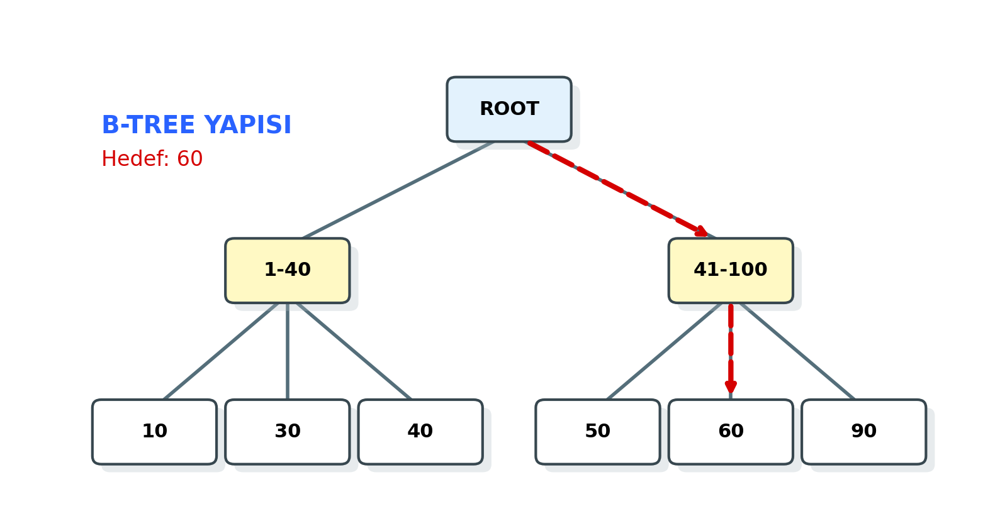

# MySQL Mimarisi, Depolama Motorları ve Performans

*Bu bölüm; MySQL'in çok katmanlı mimari yapısını, MyISAM ve InnoDB farklarını, İndeksleme ve View yapılarını kapsamaktadır.*

---

## 1. MySQL Mimarisi


MySQL, Oracle Corporation tarafından desteklenen, açık kaynaklı ve ilişkisel bir veritabanı yönetim sistemidir (RDBMS).

### Genel Özellikler

* **İstemci-Sunucu Mimarisi:** Bir sunucu (mysqld) veritabanını yönetir ve ağ üzerinden gelen istemci (client) isteklerini dinler.
* **Çoklu İş Parçacıklı (Multithreaded):** Aynı anda birden fazla isteği (query) işleyebilir. Her bağlantı kendi thread'i üzerinde çalışır.
* **Çok Kullanıcılı Yapı:** Farklı yetki seviyelerine sahip birden fazla kullanıcının eşzamanlı erişimine izin verir.
* **Platform Bağımsız:** Windows, Linux, macOS ve Unix sistemlerde çalışabilir.

### Bağlantı ve Arayüz Araçları

* **MySQL Workbench:** Resmi görsel tasarım ve yönetim aracıdır. ER diyagramı çizme, sorgu yazma ve sunucu yönetimi işlemlerini tek bir arayüzden sunar.
* **PHPMyAdmin:** Web tabanlı yönetim aracıdır. Özellikle web sunucularında (Apache/Nginx) yaygın kullanılır.
* **MySQL Connectors (Sürücüler):** Uygulamaların veritabanı ile konuşmasını sağlar.
    * **ODBC (Open Database Connectivity):** Genel amaçlı bağlantı standardı.
    * **JDBC (Java Database Connectivity):** Java uygulamaları için.
* **Komut Satırı (CLI):** `mysql -u root -p` komutu ile doğrudan terminal üzerinden erişim sağlar.

---

## 2. Depolama Motorları (Storage Engines)

MySQL'in en güçlü özelliklerinden biri, farklı tablolar için farklı depolama motorlarını destekleyen "Pluggable Storage Engine" mimarisidir.

### MyISAM

MySQL'in eski varsayılan motorudur (5.5 sürümü öncesi).

* **Kilit Mekanizması:** **Tablo Bazlı Kilit (Table-Level Locking)** kullanır. Bir yazma işlemi sırasında tüm tabloyu kilitler, bu da çok kullanıcılı yazma işlemlerinde performansı düşürür.
* **Transaction:** Desteklemez (Atomik değildir).
* **Foreign Key:** Desteklemez.
* **Avantajı:** Okuma ağırlıklı (Read-Heavy) sistemlerde ve Full-Text aramalarda çok hızlıdır.

### InnoDB

MySQL'in modern varsayılan motorudur.

* **Kilit Mekanizması:** **Satır Bazlı Kilit (Row-Level Locking)** kullanır. Sadece işlem yapılan satırı kilitler, bu da eşzamanlılığı artırır.
* **Transaction:** Tam ACID (Atomicity, Consistency, Isolation, Durability) desteği sağlar. `COMMIT` ve `ROLLBACK` işlemleri yapılabilir.
* **Foreign Key:** İlişkisel bütünlüğü (Referential Integrity) destekler.
* **Avantajı:** Veri bütünlüğünün kritik olduğu, yüksek işlem hacimli (OLTP) sistemler için idealdir.

### MyISAM vs InnoDB Karşılaştırması


| Özellik | MyISAM | InnoDB |
| :--- | :--- | :--- |
| **Transaction (ACID)** | Yok | **Var** |
| **Kilit Seviyesi** | Tablo (Table) | **Satır (Row)** |
| **Foreign Key (FK)** | Yok | **Var** |
| **Crash Recovery** | Zayıf | **Güçlü (Otomatik)** |
| **Disk Alanı** | Az yer kaplar | Daha fazla yer kaplar |
| **Kullanım Alanı** | Loglama, Salt Okunur Veri | Bankacılık, E-Ticaret |

!!! warning "Sınav Bilgisi"
    Sınavda "Hangi durumda MyISAM, hangi durumda InnoDB seçilmelidir?" sorusu gelebilir.
    
    **Cevap:** Veri bütünlüğü ve Transaction gerekiyorsa (Para transferi vb.) kesinlikle **InnoDB**; sadece log tutulacaksa veya çok hızlı okuma gerekiyorsa **MyISAM**.

---

## 3. Görünümler (Views)

View, fiziksel olarak veri tutmayan, ancak kaydedilmiş bir `SELECT` sorgusunun sonucunu bir tablo gibi sunan sanal yapıdır.

### View Nedir ve Avantajları?

1.  **Güvenlik:** Kullanıcılara tablonun tamamı yerine sadece belirli sütunlarını veya satırlarını göstermek için kullanılır (Örn: Personel tablosundaki Maaş sütununu gizleyen bir View).
2.  **Karmaşıklığı Gizleme:** Karmaşık `JOIN` işlemlerini içeren sorguları tek bir View altına alarak, kullanıcının basit bir `SELECT` ile veriye ulaşmasını sağlar.
3.  **Depolama Avantajı:** Veriyi fiziksel olarak kopyalamaz, sadece sorgu tanımını saklar.

### View İşlemleri (SQL)

**View Oluşturma:**

```sql
CREATE VIEW IstanbulMusterileri AS
SELECT Ad, Soyad, Telefon
FROM Musteriler
WHERE Sehir = 'İstanbul';
```

**View Kullanma:**

```sql
SELECT * FROM IstanbulMusterileri;
```

**View Güncelleme:**

```sql
CREATE OR REPLACE VIEW IstanbulMusterileri AS
SELECT Ad, Soyad, Telefon, Email
FROM Musteriler
WHERE Sehir = 'İstanbul';
```

**View Silme:**

```sql
DROP VIEW IstanbulMusterileri;
```

---

## 4. İndeksler (Indexes)



İndeksler, veritabanı performans optimizasyonunun en temel taşıdır.

### İndeks Nedir ve Neden Kullanılır?

Veritabanı indeksleri, bir kitaptaki "İçindekiler" veya arka sayfadaki "İndeks" bölümüne benzer. Aranan veriye, tüm satırları tek tek taramak (**Full Table Scan**) yerine, bir ağaç yapısı (B-Tree) üzerinden çok daha hızlı ulaşılmasını sağlar.

!!! note "Performans Dengesi (Trade-off)"
    İndeksler **okuma (SELECT)** hızını muazzam derecede artırır. Ancak **yazma (INSERT, UPDATE, DELETE)** hızını düşürür. Çünkü her veri girişinde indeks yapısının da güncellenmesi ve yeniden sıralanması gerekir.

### İndeks Türleri

1.  **Tek Kolonlu İndeks:** Sadece bir sütun üzerine kurulur.
2.  **Benzersiz (Unique) İndeks:** Sütundaki verilerin tekrarsız olmasını zorunlu kılar (Primary Key otomatik olarak Unique İndekstir).
3.  **Bileşik (Composite) İndeks:** Birden fazla sütunun kombinasyonu üzerine kurulur. (Örn: Hem `Ad` hem `Soyad` ile arama yapılıyorsa).

### Clustered vs Non-Clustered İndeks

* **Clustered (Kümelenmiş) İndeks:** Verinin disk üzerindeki **fiziksel sıralamasını** belirler. Bir tabloda **sadece bir tane** olabilir (Genellikle Primary Key). Sözlükteki kelimeler gibi, verinin kendisi sıralıdır.
* **Non-Clustered (Kümelenmemiş) İndeks:** Kitabın arkasındaki indeks gibidir. Mantıksal bir sıralama ve asıl veriye giden bir işaretçi (pointer) tutar. Bir tabloda birden fazla olabilir.

### İndeks Yönetimi (SQL)

**İndeks Oluşturma:**

```sql
-- MusteriAdi sütununa indeks ekler
CREATE INDEX idx_musteri_adi ON Musteriler(MusteriAdi);

-- Benzersiz indeks ekler (E-posta tekrar edemez)
CREATE UNIQUE INDEX idx_email ON Personel(Email);
```

**İndeksleri Listeleme:**

```sql
SHOW INDEX FROM Musteriler;
```

**İndeks Silme:**

```sql
DROP INDEX idx_musteri_adi ON Musteriler;
```

---

## 5. Kısıtlayıcılar (Constraints)

Veri bütünlüğünü (Data Integrity) korumak için tablolara uygulanan kurallardır.

### Temel Kısıtlayıcılar

* **NOT NULL:** Sütunun boş geçilemeyeceğini belirtir.
* **UNIQUE:** Sütundaki tüm değerlerin farklı olmasını sağlar.
* **PRIMARY KEY:** Satırı benzersiz tanımlar (NOT NULL + UNIQUE). İndeksleme yapar.
* **FOREIGN KEY:** Başka bir tablonun Primary Key'ine referans verir (İlişkisel bütünlük).
* **CHECK:** Verinin belirli bir şarta uymasını zorlar (Örn: `Yas > 18`).
* **DEFAULT:** Veri girilmezse varsayılan değer atar.
* **AUTO_INCREMENT:** Sayısal alanı otomatik artırır (Genellikle ID için).

### ALTER TABLE ile Kısıtlayıcı Yönetimi

Tablo oluşturulduktan sonra kısıtlayıcı eklemek veya çıkarmak için `ALTER TABLE` kullanılır.

**Primary Key Ekleme:**

```sql
ALTER TABLE Ogrenciler
ADD PRIMARY KEY (OgrenciNo);
```

**Foreign Key Ekleme:**

```sql
ALTER TABLE Siparisler
ADD CONSTRAINT fk_musteri
FOREIGN KEY (MusteriID) REFERENCES Musteriler(MusteriID);
```

**Constraint Silme:**

```sql
-- MySQL'de PK silme
ALTER TABLE Ogrenciler DROP PRIMARY KEY;

-- MySQL'de FK silme (Önce constraint ismini bilmek gerekir)
ALTER TABLE Siparisler DROP FOREIGN KEY fk_musteri;
```